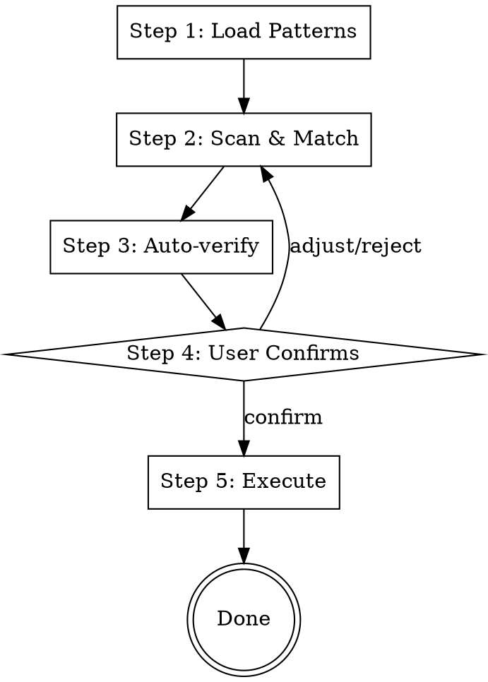

# Dependency Migrator

## Overview

{{OVERVIEW_DESCRIPTION}}

## When to Use

{{WHEN_TO_USE}}

## The Five-Step Workflow



**Violating the letter of this workflow is violating the spirit of this skill.**

### Step 1: Load Patterns

Call `python3 scripts/load_patterns.py` (from the skill directory). This reads all `rules/*/pattern.md` (skipping directories starting with `_`) and returns XML-wrapped merged output.

```
<rule name="rule-name">
[pattern.md content]
</rule>
```

Do NOT skip this step. The script output is the authoritative source of all matching knowledge.

### Step 2: Scan & Match

Using all pattern descriptions from Step 1, scan code in the current context. For each match found, collect:

- **File location** — which file contains the match
- **Code snippet** — the specific code that matched
- **Rule name** — which pattern was matched

Be thorough. Read all relevant files in the target scope. Do not stop at the first match — find every instance.

If no matches are found for any pattern, report that clearly — the workflow ends here.

### Step 3: Auto-verify

For each match from Step 2, automatically load the corresponding solution to cross-validate the match:

1. Call `python3 scripts/load_solutions.py <rule-name>...` with all matched rule names
2. Read each solution content. If a solution references code files (e.g., `examples/before.ext`), read them on demand
3. Cross-validate: use the solution's description to verify the match is accurate and the solution actually applies to the matched code
4. **Discard false positives** — only retain matches that pass validation

The goal is to catch mismatches before they reach the user. If all matches are discarded, report that clearly and suggest adjusting the rules or scope.

Do NOT skip this step. It is not optional — raw pattern matching alone is too loose; the solution context is needed to confirm applicability.

### Step 4: User Confirms

Present all verified matches to the user in a structured list, including:

- File location
- Matched code snippet
- Applicable rule name
- Proposed solution summary

The user can:

- **Confirm** — proceed with replacement
- **Skip** — exclude a specific match
- **Adjust** — refine the matching scope or modify the proposed approach

Do NOT proceed to Step 5 without user confirmation. Even if only one match is found, wait for explicit approval.

### Step 5: Execute

For confirmed matches, execute replacements. Subagent dispatch is optional — choose based on the number and complexity of replacements. Solutions were already loaded in Step 3, so no script calls are needed here.

After execution, report what was changed.

## Common Mistakes

| Mistake | Fix |
|---------|-----|
| Skipping Step 1 and manually reading patterns | Always use load_patterns.py script |
| Skipping Step 3 and presenting raw matches to user | Always auto-verify with solutions first |
| Proceeding to Step 5 without user confirmation | Always wait for explicit approval |
| Not reading all files in target scope | Be thorough, find every instance |
