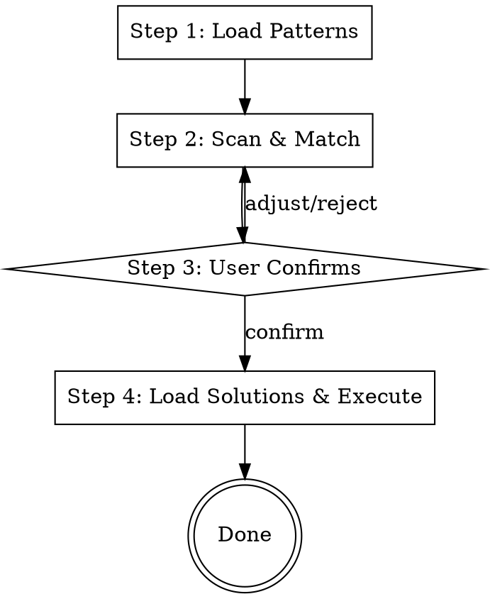

# Dependency Migrator

## Overview

{{OVERVIEW_DESCRIPTION}}

## When to Use

{{WHEN_TO_USE}}

## The Four-Step Workflow



**Violating the letter of this workflow is violating the spirit of this skill.**

### Step 1: Load Patterns

Call `python3 scripts/load_patterns.py` (from the skill directory). This reads all `rules/*/pattern.md` (skipping directories starting with `_`) and returns XML-wrapped merged output.

```
<rule name="rule-name">
[pattern.md content]
</rule>
```

Do NOT skip this step. The script output is the authoritative source of all matching knowledge.

### Step 2: Scan & Match

Using all pattern descriptions from Step 1, scan code in the current context. For each match found, report:

- **File location** — which file contains the match
- **Code snippet** — the specific code that matched
- **Rule name** — which pattern was matched

Be thorough. Read all relevant files in the target scope. Do not stop at the first match — find every instance.

If no matches are found for any pattern, report that clearly.

### Step 3: User Confirms

Present all match results to the user in a structured list. The user can:

- **Confirm** — proceed with replacement
- **Skip** — exclude a specific match
- **Adjust** — refine the matching scope

Do NOT proceed to Step 4 without user confirmation. Even if only one match is found, wait for explicit approval.

### Step 4: Load Solutions & Execute

For confirmed matches:

1. Call `python3 scripts/load_solutions.py <rule-name>...` with confirmed rule names to load corresponding solutions
2. Read solution content. If solution references code files (e.g., `examples/before.ext`), read them on demand when the context requires it
3. Execute replacements. Subagent dispatch is optional — choose based on the number and complexity of replacements

After execution, report what was changed.

## Adding New Rules

Run `python3 scripts/create_rule.py <rule-name>` from the skill directory. This creates:

```
rules/<rule-name>/
  pattern.md       ← from template
  solution.md      ← from template
```

Edit both files. Optionally add `examples/` directory with code reference files.

No changes to SKILL.md or scripts are needed.

## Rules Directory Structure

```
rules/
  _example/              ← skipped by load_patterns.py
    pattern.md
    solution.md
    examples/
      before.example
      after.example
  your-rule-name/        ← add as many as needed
    pattern.md
    solution.md
    examples/            ← optional
      ...
```

## Common Mistakes

| Mistake | Fix |
|---------|-----|
| Skipping Step 1 and manually reading patterns | Always use load_patterns.py script |
| Proceeding to Step 4 without user confirmation | Always wait for explicit approval |
| Not reading all files in target scope | Be thorough, find every instance |
| Modifying SKILL.md when adding rules | Only add directories under rules/ |
| Writing solution content inline in pattern.md | Keep pattern and solution separate |
