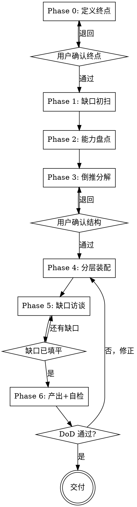

# Designing Workflows

## 概述

把"用 AI 做某事"这个目标，编排成一份**能盲跑**的分层 playbook。

**能力盘点驱动**：先盘点手上有哪些 skill / tool，再倒推怎么编排——而不是凭印象拍脑袋。
**以终为始**：先定义"什么叫做完"，再设计步骤。
**真封装**：产出物是目录 + 按需加载，不是一坨平铺长文件。

违反字面规则，就是违反这个 skill 的精神。

## 何时使用

- 用户想用 AI 完成一个**多步骤、需要组合多个能力**的目标
- 想要一份**可复用**的 workflow（不是一次性跑完就丢）
- 需要想清楚"还缺哪些上下文/知识"再去执行

**不要用于：**

- 单步任务（直接做，别编排）
- 软件功能设计 → 用 `brainstorming`
- 把 spec 变成代码实现计划 → 用 `writing-plans`
- 真正想要的产物是一个**新 skill** → 用 `writing-skills`（本 skill 产出 playbook，不产出 skill）

## 铁律

```
没有定义"终点"，就不准设计步骤。
```

每份 playbook 动手之前，必须先把"什么叫做完"钉死：成功标准、硬约束、消费模式。跳过这步直接列步骤，违反本 skill 精神。

**无例外：**
- 不是"目标很显然就不用定义"
- 不是"我脑子里已经有数了"
- 不是"先列步骤边做边想"
- 定义意味着把成功标准写下来并经用户确认，不是含糊带过

## 依赖

- **借鉴：** `writing-skills`（封装阈值、按需拆分的原则）
- **边界：** `brainstorming`（feature→spec）、`writing-plans`（spec→代码 plan）。本 skill 的区分点：**能力盘点驱动**，产物是能力编排 playbook。

## 内置五原则

### 1. 能力分层（Taxonomy）

判定一个能力属于哪层，按**复用度 + 目标特异性**，**不是**按"有没有判断"（workflow 本身是 prompt，也能含判断）：

| 层 | 特征 | 判定问题 | 类比 |
|---|---|---|---|
| **Tool** | 原子、确定性、无判断 | 不用 LLM 写段程序就能做？ | 系统调用 |
| **Skill** | 高复用、低目标特异性、领域专长 | 跨很多目标可复用，编码"怎么判断"？ | 库 / 模块 |
| **Workflow** | 低复用、高目标特异性、编排 | 绑定具体目标，按序组合若干能力？ | 程序 / 脚本 |

### 2. 封装 / 渐进披露

分层不是单文件里的标题排版，是**物理拆分 + 按需加载**。必须同时满足：稳定接口 + 可替换实现 + 懒加载。低于规模阈值才退化为单文件（见产物规格）。

### 3. 以终为始

先定义终点（成功标准 / 约束 / 消费模式），再倒推步骤。缺口初扫排在能力盘点**之前**——"还差什么"比"手上有什么"更能暴露问题。

### 4. 最简优先

默认从最简编排开始，**只有当能证明它改善结果时才加复杂度**。单次 LLM 调用能解决的，别套 orchestrator-workers。

### 5. 前置交互（设计时交互，运行时自治）

两个阶段对交互的需求相反，必须分清：

| 阶段 | 交互要求 | 原因 |
|---|---|---|
| **设计期**（本 skill 跑） | **强制**用户 review（Phase 0/3 gate + Phase 5 缺口访谈） | 一次性把人的判断、约束、缺失上下文投进去 |
| **运行期**（产出的 playbook 跑） | **尽量自治**，少打扰用户 | 投入前置交互，正是为了换得之后能反复无人值守 |

这条是铁律的延伸：**设计期不准跳过 gate 一次性产出**——那会把缺口和误判推到运行期，让用户每次跑都来填坑，违背"可复用"。运行期 gate 能机检就机检，只在真正需要人判断处留人检。

## 六阶段流程



---

### Phase 0：定义终点

把"做完"钉死，**先不碰任何步骤**。必须产出：

- **成功标准**：什么结果算成功？（可观测、可判断）
- **硬约束**：时间、成本、工具、合规、必须/禁止什么
- **消费模式**：谁执行这份 playbook？（默认 **agent 跑**：运行期尽量自治——gate 能机检就机检，只在真正需要人判断处留人检。把交互留在设计期，见原则 5）

**门：** 用户确认终点定义，才进入 Phase 1。

### Phase 1：缺口初扫

朝着终点看，列出**还不知道但执行时必须知道**的东西。例如：需要的数据、需要的访问权限、领域里未明的规则、外部依赖是否可用。先不求填平，只求**暴露**。

### Phase 2：能力盘点

**已安装能力 + 可选扫描目录**：

1. 先盘点当前会话能访问的 skill（系统提示里的可用 skill 清单）+ 原生工具。
2. 若用户指定一个 skills 目录（如本仓库、`~/.claude/skills`），额外扫描其下的 `SKILL.md`，取 `name` + `description` 作为候选。
3. 产出**候选能力池**：每个能力记下 name、用途、属于 tool/skill 哪层。

只盘点**真实存在**的能力。后续步骤禁止引用能力池之外的东西。

### Phase 3：倒推分解

从终点反推：要达成这个结果，需要哪些阶段？每个阶段需要哪些步骤？对每一步判定：

- 用哪个能力？（必须来自 Phase 2 的能力池，标明 `tool:X` / `skill:Y` / `inline 推理`）
- 输入是什么、产出是什么
- 是否需要 gate

**编排模式选择**（默认从最简开始）：

| 模式 | 适用 | 复杂度 |
|---|---|---|
| 单次 LLM 调用 | 能一步搞定 | 最低（先考虑） |
| Prompt 链 | 可干净拆成固定子步骤 | 低 |
| 路由 | 输入可分类、各类适合不同处理 | 中 |
| 并行（分区/投票） | 子任务独立可并行 / 需多视角 | 中 |
| Orchestrator-workers | 子任务无法预知、需动态分派 | 高 |
| Evaluator-optimizer | 有明确评价标准、迭代有收益 | 高 |

**门：** 用户确认阶段/步骤结构，才进入 Phase 4。

### Phase 4：分层装配

按产物规格组装。**先判定规模**：是否超过单文件退化阈值（见下）。超过 → 目录结构；否则 → 单文件。装配时把 Phase 1 的缺口留痕写进 Meta 区。

### Phase 5：缺口访谈

把 Phase 1 暴露的缺口**逐条问清楚**：

- **一次只问一个问题**（多选优先，比开放式省力）
- 每个缺口问到位：需要的具体值、来源、格式、边界
- 填平一个，在 Meta 区划掉一个
- 全部填平才进入 Phase 6；执行时才发现缺口的，退回本 phase

### Phase 6：产出 + 自检

按 **Definition of Done** 逐条验：

> 任意的 agent 拿到这份 playbook，能**按 phase 逐步正确执行**——每个 phase 只加载它那一个 step 文件，**中途不需要再回来问设计问题**。

自检清单：

| 检查 | 通过条件 |
|---|---|
| 盲跑可行 | 不缺输入、不缺能力引用、不缺判定标准 |
| 分层正确 | 规模超阈值的一定拆成目录，不是平铺单文件 |
| 能力真实 | 每步引用的能力都在 Phase 2 能力池内 |
| 分类正确 | 没把 tool 该做的标成 skill，或反之 |
| 没过度编排 | 没有该单步却套多 agent 的情况 |

不通过 → 回 Phase 4 修正，不交付。

### 关于 gate：设计期必须真交互

Phase 0/3 的 gate 和 Phase 5 的访谈**不是可选流程装饰**，是本 skill 的必要环节。设计期必须真有用户确认：

- 不准为了"一次性交付"跳过 gate
- 不准用一堆默认值默默假设越过确认
- 如果当前没有用户可交互（例如被当工具一次性调用）→ **明确声明本 skill 需要交互式 review，退回请求逐 phase 确认**，而不是自己拍板

把交互前置到设计期，正是为了让运行期尽量自治（见原则 5）。

## 产物规格

### 目录结构（默认）

```
playbooks/<name>/
  flow.md            L0 目标 + L1 阶段流程 + Meta    ← 唯一入口，永远先读
  steps/
    01-<phase>.md    该 phase 的 L2 步骤 + L3 可执行 prompt + 机检 gate   ← 执行到才加载
    02-...
  gaps.md            缺口分析留痕（可选）
```

**`flow.md`（接口层）必含：** 一句话目标、阶段流程（图或表）、Meta（必需输入 / 复用能力 / 已填缺口留痕）。

**每个 step 文件（agent 模式）必含：** 可执行 prompt、精确能力引用（`tool:X`/`skill:Y`/`inline`）、inputs→outputs、机检 gate。

**执行契约：** 跑 playbook 时，先完整读 `flow.md`；执行到某 phase 才读对应 `steps/NN.md`；上一 gate 通过才加载下一步。

### 单文件退化阈值

**同时满足**才退化单文件，否则必须拆目录：
- 步骤数 ≤ 5
- 没有任何一个 step 的 L3 细节 > 约 30 行
- 只有一个或很少 phase

**完整带注释的模板**：见 `playbook-template.md`（按需加载，装配阶段才读）。

## 速查

| Phase | 产出 | 门 |
|---|---|---|
| 0 定义终点 | 成功标准 + 约束 + 消费模式 | 用户确认终点 |
| 1 缺口初扫 | 缺口清单 | — |
| 2 能力盘点 | 候选能力池（tool/skill 分类） | — |
| 3 倒推分解 | 阶段/步骤结构 + 编排模式 | 用户确认结构 |
| 4 分层装配 | 目录或单文件骨架 | — |
| 5 缺口访谈 | 缺口逐条填平 | 缺口已填平 |
| 6 产出+自检 | DoD 通过的 playbook | DoD 通过 |

## 常见错误

| 错误 | 修正 |
|---|---|
| 没定义终点就列步骤 | 回 Phase 0，把成功标准写下来经用户确认 |
| 该拆目录却输出平铺单文件 | 按"单文件退化阈值"判定，超阈值必须拆 |
| 把 tool 该做的事标成 skill（或反之） | 按 Taxonomy 三问重新判定 |
| 跳过缺口分析 | Phase 1 必做；不填平缺口 playbook 无法盲跑 |
| 过度编排（该单步却套多 agent） | 从最简模式开始，证明有收益才加复杂度 |
| 引用能力池之外、不存在的 skill | 只用 Phase 2 盘点到的真实能力 |
| step 文件不自足，执行时还得问设计问题 | 按 DoD 退回 Phase 4 补全 |
| 设计期为"一次性交付"跳过 gate / 默默假设 | 退回逐 phase 请用户确认；交互前置是本 skill 的必要环节 |
| 运行期 gate 全靠人判断，用户每次跑都来填坑 | 能机检的全改机检；人检只留真正需要判断处 |

## 危险信号 —— 停下重来

- 你在没写"成功标准"的情况下开始列步骤
- 产出是一个 500 行平铺文件，没有目录、没有按需加载
- 编排里出现了能力池里没有的 skill
- 把判定"用不用 LLM"当成 tool/skill 的分界（错——分界是复用度+目标特异性）
- 你为了快点交付想跳过 Phase 0/3 的用户确认
- 你觉得"差不多了" → 跑一遍 Phase 6 自检再说
