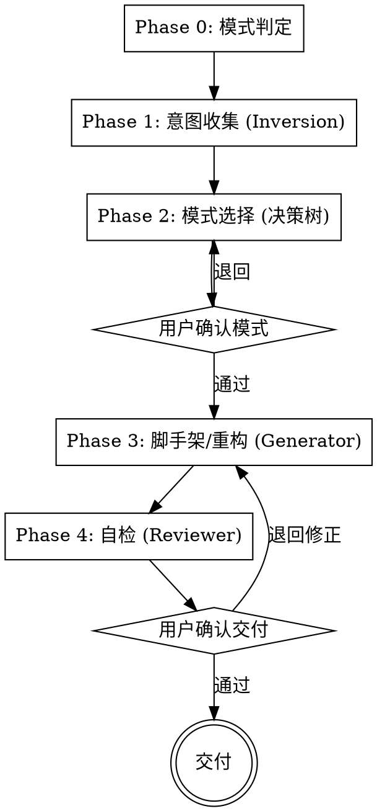

# skill-architect 实现计划

> **For agentic workers:** REQUIRED SUB-SKILL: Use superpowers:subagent-driven-development (recommended) or superpowers:executing-plans to implement this plan task-by-task. Steps use checkbox (`- [ ]`) syntax for tracking.

**Goal:** 建一个顶层 `skill-architect/` skill，用 Google ADK 五模式帮用户选模式、出脚手架、重构屎山 skill；本 skill 自身是组合式 Pipeline。

**Architecture:** 方案 A——一个薄的 `SKILL.md`（Pipeline 编排器 + 决策树速查），`references/` 放五模式详解与重构清单，`assets/templates/` 放五种模式脚手架。本 skill 内部示范 Inversion/Generator/Reviewer/Tool Wrapper。

**Tech Stack:** 纯 Markdown（遵循 agentskills.io 与本仓库 writing-skills 规范）。无可执行代码。

**Spec:** `docs/superpowers/specs/2026-07-08-skill-architect-design.md`

**关于 TDD：** 本交付物是 skill 文档（非可执行代码），逐文件无法"先写失败测试"。故每个文件任务的验证 = 读回 + 校验 frontmatter + 校验被引用文件存在。skill 有效性验证（writing-skills 铁律）集中在末尾 Task 10 的双模式冒烟测试。

**文件结构：**

| 文件 | 职责 |
|---|---|
| `skill-architect/SKILL.md` | 薄的 Pipeline 编排器 + 决策树速查 + 五阶段门控（主入口，始终加载） |
| `skill-architect/references/pattern-catalog.md` | 五模式详解 + 组合规则（Phase 2/3 按需加载） |
| `skill-architect/references/refactor-checklist.md` | 屎山信号→修正表 + 自检协议（Phase 4 加载） |
| `skill-architect/assets/templates/tool-wrapper.md` | Tool Wrapper 模式 SKILL.md 脚手架 |
| `skill-architect/assets/templates/generator.md` | Generator 模式脚手架 |
| `skill-architect/assets/templates/reviewer.md` | Reviewer 模式脚手架 |
| `skill-architect/assets/templates/inversion.md` | Inversion 模式脚手架 |
| `skill-architect/assets/templates/pipeline.md` | Pipeline 模式脚手架 |
| `README.md` / `README.zh-CN.md` | 登记 skill-architect |

---

### Task 1: 建目录结构

**Files:**
- Create: `skill-architect/`（空目录，git 不跟踪空目录，本任务仅确认/创建子目录路径）

- [ ] **Step 1: 创建全部子目录**

Run:
```bash
mkdir -p skill-architect/references skill-architect/assets/templates
```
Expected: 目录创建成功，无报错。

- [ ] **Step 2: 验证目录存在**

Run:
```bash
ls skill-architect
```
Expected: 列出 `assets/` 与 `references/`。

---

### Task 2: references/pattern-catalog.md

**Files:**
- Create: `skill-architect/references/pattern-catalog.md`

- [ ] **Step 1: 写入文件**

完整内容：

````markdown
# 五模式详解（pattern-catalog）

本文件是 skill-architect 的 Tool Wrapper 知识库。Phase 2 选模式、Phase 3 出脚手架时按需加载。

## 模式 1：Tool Wrapper —— 教 agent 一个库/框架

**何时用：** 要让 agent 成为某库、框架、内部系统的专家，按需套用其约定。最简单、最常见。

**用到的目录：** `references/`（放详细约定）。

**骨架要点：**
- description 含具体库名关键词（"FastAPI"、"Pydantic"、"React"），别写"帮你搞 API"这种泛话。
- 正文：`Apply these conventions…`，指向 `references/conventions.md`。
- 评审代码时：加载约定 → 逐条对照 → 每个违规 cite 规则 + 给修正。
- 写代码时：加载约定 → 严格遵循。

**最小示例（SKILL.md 片段）：**
```yaml
---
name: api-expert
description: Use when building, reviewing, or debugging FastAPI applications, REST APIs, or Pydantic models. Apply FastAPI best practices on demand.
---
```
```markdown
你是 FastAPI 专家。评审/写代码时加载 `references/conventions.md` 并逐条套用。
```

**门控：** 无（最简单，无多步）。

## 模式 2：Generator —— 产出固定结构

**何时用：** 产物每次都要遵循同一模板（报告、API 文档、commit message、脚手架）。一致性 > 创造性。

**用到的目录：** `assets/`（输出模板）+ `references/`（style guide / 质量规则）。

**骨架要点：**
- 分步编排：加载 style guide → 加载 template → 收集缺失输入 → 填模板 → 返回。
- 模板定义必有的 section；style guide 定义语气/格式/质量。
- 换 template 或 style guide 即换产出，正文不用改。

**门控：** 可在"收集缺失输入"处加一问一答。

## 模式 3：Reviewer —— 对照 checklist 评估

**何时用：** 要对代码/内容按 checklist 评估、按严重度（error/warning/info）归类 findings。把 WHAT 查（checklist 文件）与 HOW 查（评审协议）分开——换 checklist 即换评审。

**用到的目录：** `references/`（checklist）。

**骨架要点：**
- 协议：加载 checklist → 读代码理解意图 → 逐条评 → 每个违规给 行号+严重度+原因+修正 → 产出 Summary / Findings（按严重度）/ Score / Top3 建议。

**门控：** 无；产出即止。

## 模式 4：Inversion —— skill 先采访你

**何时用：** agent 动手前必须先从用户拿上下文（需求采集、诊断问诊、配置向导）。防止"基于假设直接生成"。

**用到的目录：** `assets/`（合成阶段用的输出模板）。

**骨架要点：**
- 分阶段提问，每阶段问完才进下一个。
- 顶部必须写 `DO NOT start building/designing until all phases are complete`——这是关键门，没它 agent 会第一个答案后就跳结论。
- 全部答完才加载模板合成。

**门控：** 阶段门 + 顶部总门。

## 模式 5：Pipeline —— 强制多步工作流

**何时用：** 有顺序依赖、步骤间要校验门。最复杂；可用上全部三种目录 + 步骤间控制流。

**用到的目录：** `references/` + `assets/` + `scripts/`（若有可执行脚本）。

**骨架要点：**
- 每步必须完成才能进下一步。
- 门条件是定义性特征：`Do NOT proceed to Step N until the user confirms`、`Do NOT skip steps or proceed if a step fails`。
- 每步按需加载不同资源，省 context。

**门控：** 步骤间校验门（机检优先，需人判断处留人检）。

## 组合规则

模式可组合，生产系统通常组合 2-3 种：

- **Pipeline + Reviewer**：Pipeline 的某步内嵌一个 Reviewer（加载 checklist 评估）。例：doc-pipeline 的 Step 4 是质量评审。
- **Generator + Inversion**：Generator 先用 Inversion 收集输入，再填模板。
- **Pipeline + Inversion + Generator + Reviewer**：本 skill skill-architect 就是这个组合。
- **Tool Wrapper 作 reference**：Tool Wrapper 的约定文件可作为 Pipeline 内某步的 reference。

**选择优先级：** 单步能搞定 → 别套 Pipeline。先最简，证明有收益才加复杂度。
````

- [ ] **Step 2: 验证**

Run:
```bash
head -5 skill-architect/references/pattern-catalog.md
```
Expected: 显示标题行 `# 五模式详解（pattern-catalog）`。

- [ ] **Step 3: Commit**

```bash
git add skill-architect/references/pattern-catalog.md
git commit -m "feat(skill-architect): add 5-pattern catalog reference"
```

---

### Task 3: references/refactor-checklist.md

**Files:**
- Create: `skill-architect/references/refactor-checklist.md`

- [ ] **Step 1: 写入文件**

完整内容：

````markdown
# 重构自检清单（refactor-checklist）

Phase 4 加载。既是"屎山诊断"清单，也是重构后的验收清单。

## 屎山信号 → 修正

| 屎山信号 | 修正动作 |
|---|---|
| 规则/约定全硬编码在 `SKILL.md` 正文 | 抽到 `references/`，按需加载 |
| 输出格式写死在正文 | 抽到 `assets/` 模板 |
| 评估/检查逻辑写死在正文 | 抽成 `references/` checklist（→ Reviewer 模式） |
| 一个文件干五件事 | 选一个主模式 + 模块化；确属多职责才考虑 splitting-skills |
| description 没有"Use when..."或太泛 | 按 CSO 重写：只写触发条件 + 症状关键词，不摘要工作流 |
| description 摘要了工作流 | 删掉流程描述，只留"何时该用" |
| 工作流没门控 | 顺序步骤间加 `Do NOT proceed until…` 门（→ Pipeline） |
| 全部内容每次都加载 | 渐进披露：SKILL.md 薄，重型内容外置 references/assets |
| 该用 Pipeline 却顺序乱 | 把步骤重排为顺序 + 门 |
| 该单步却套了流水线 | 删多余编排，回归最简 |
| frontmatter 缺 name 或 description | 补全；name 仅字母数字连字符；description ≤1024 字符 |

## 自检协议

1. 读重构后的 `SKILL.md` 与全部资源，确认**原功能都在**（行为等价，没删功能）。
2. 逐条对照上表，标记每个信号是 ✅ 已修正 / ❌ 未修正。
3. 验证 description：模拟几个真实用户提问，判断该 skill 会不会被正确触发。
4. 验证渐进披露：SKILL.md 是否够薄？重型内容是否都外置？
5. 验证模式一致性：选定的模式用对了目录和门控吗？
6. 有 ❌ → 回 Phase 3 修，再回本清单。

## 通过条件

- 上表全部 ✅
- 原功能无丢失
- description 触发测试通过
- 模式目录与门控齐备
````

- [ ] **Step 2: 验证**

Run:
```bash
head -3 skill-architect/references/refactor-checklist.md
```
Expected: 显示标题行 `# 重构自检清单（refactor-checklist）`。

- [ ] **Step 3: Commit**

```bash
git add skill-architect/references/refactor-checklist.md
git commit -m "feat(skill-architect): add refactor self-check checklist"
```

---

### Task 4: assets/templates/tool-wrapper.md

**Files:**
- Create: `skill-architect/assets/templates/tool-wrapper.md`

- [ ] **Step 1: 写入文件**

完整内容：

````markdown
---
name: <skill-name>
description: Use when <具体触发场景与库名/领域关键词>. Apply <库/领域> best practices on demand. Do NOT use for <反例>.
---

# <Skill Name>

## 概述
你是 <库/领域> 专家。评审或写代码时套用以下约定。

## 何时使用
- <症状/场景 1>
- <症状/场景 2>

**不要用于：**
- <反例>

## 核心约定
完整清单按需加载 `references/conventions.md`。要点：
- <约定 1>
- <约定 2>

## 评审代码时
1. 加载 `references/conventions.md`
2. 逐条对照用户代码
3. 每个违规：cite 规则 + 给修正

## 写代码时
1. 加载 `references/conventions.md`
2. 严格遵循每条约定
````

- [ ] **Step 2: 验证**

Run:
```bash
head -4 skill-architect/assets/templates/tool-wrapper.md
```
Expected: 显示 `---` frontmatter 起始与 `name: <skill-name>`。

- [ ] **Step 3: Commit**

```bash
git add skill-architect/assets/templates/tool-wrapper.md
git commit -m "feat(skill-architect): add tool-wrapper template"
```

---

### Task 5: assets/templates/generator.md

**Files:**
- Create: `skill-architect/assets/templates/generator.md`

- [ ] **Step 1: 写入文件**

完整内容：

````markdown
---
name: <skill-name>
description: Use when the user asks to write/create/draft a <产物类型>. Produces <产物类型> following a fixed template. Do NOT use for <反例>.
---

# <Skill Name>

## 概述
按固定模板产出 <产物类型>。一致性优先。

## 步骤（严格按序）
1. 加载 `references/style-guide.md` 取语气/格式/质量规则
2. 加载 `assets/<产物>-template.md` 取输出结构
3. 问用户补齐缺失输入（一次一问）：
   - <必填输入 1>
   - <必填输入 2>
4. 按 style guide 填模板——模板里每个 section 都必须有内容
5. 以单个文档返回成品

## 通过条件
- 模板所有 section 齐全
- 符合 style guide
````

- [ ] **Step 2: 验证**

Run:
```bash
head -4 skill-architect/assets/templates/generator.md
```
Expected: 显示 frontmatter 与 `name: <skill-name>`。

- [ ] **Step 3: Commit**

```bash
git add skill-architect/assets/templates/generator.md
git commit -m "feat(skill-architect): add generator template"
```

---

### Task 6: assets/templates/reviewer.md

**Files:**
- Create: `skill-architect/assets/templates/reviewer.md`

- [ ] **Step 1: 写入文件**

完整内容：

````markdown
---
name: <skill-name>
description: Use when the user submits <对象> for review, asks for feedback on <对象>, or wants a <对象> audit. Evaluates against a checklist, grouped by severity. Do NOT use for <反例>.
---

# <Skill Name>

## 概述
对照 checklist 评估 <对象>，按严重度归类 findings。

## 评审协议（严格按序）
1. 加载 `references/review-checklist.md` 取评审标准
2. 先读懂 <对象> 的意图，再评
3. 逐条套用 checklist，每个违规给：
   - 行号 / 位置
   - 严重度：error（必修）/ warning（应修）/ info（可考虑）
   - 为什么错（不只说错在哪）
   - 具体修正（带改后代码）
4. 产出结构化评审：
   - **Summary**：做什么的、整体质量
   - **Findings**：按严重度分组（error → warning → info）
   - **Score**：1–10 + 简述
   - **Top 3 建议**：最有价值的改进

## 换评审标准
换 `references/review-checklist.md` 即换评审，正文不用改。
````

- [ ] **Step 2: 验证**

Run:
```bash
head -4 skill-architect/assets/templates/reviewer.md
```
Expected: 显示 frontmatter 与 `name: <skill-name>`。

- [ ] **Step 3: Commit**

```bash
git add skill-architect/assets/templates/reviewer.md
git commit -m "feat(skill-architect): add reviewer template"
```

---

### Task 7: assets/templates/inversion.md

**Files:**
- Create: `skill-architect/assets/templates/inversion.md`

- [ ] **Step 1: 写入文件**

完整内容：

````markdown
---
name: <skill-name>
description: Use when the user says "<触发语>", wants to plan/design <对象>, or needs <产物>. Conducts a structured requirements interview before producing output. Do NOT use for <反例>.
---

# <Skill Name>

## 概述
你在做结构化需求访谈。**在所有阶段完成前，不准开始构建/设计。**

## Phase 1 —— <主题 1>（一次一问，等答）
- Q1: "<问题 1>"
- Q2: "<问题 2>"

## Phase 2 —— <主题 2>（Phase 1 全部答完才进）
- Q3: "<问题 3>"
- Q4: "<问题 4>"

## Phase 3 —— 合成（全部答完才进）
1. 加载 `assets/<产物>-template.md` 取输出格式
2. 用访谈答案填满模板每个 section
3. 呈现成品，问："这准确反映你的需求吗？要改什么？"
4. 按反馈迭代到用户确认
````

- [ ] **Step 2: 验证**

Run:
```bash
head -4 skill-architect/assets/templates/inversion.md
```
Expected: 显示 frontmatter 与 `name: <skill-name>`。

- [ ] **Step 3: Commit**

```bash
git add skill-architect/assets/templates/inversion.md
git commit -m "feat(skill-architect): add inversion template"
```

---

### Task 8: assets/templates/pipeline.md

**Files:**
- Create: `skill-architect/assets/templates/pipeline.md`

- [ ] **Step 1: 写入文件**

完整内容：

````markdown
---
name: <skill-name>
description: Use when the user asks to <目标动作> through a multi-step pipeline. Executes ordered steps with validation gates between them. Do NOT use for <反例>.
---

# <Skill Name>

## 概述
你在跑一个 <目标> 流水线。按序执行每步。**不准跳步；某步失败就不准继续。**

## Step 1 —— <阶段 1>
<做什么>。呈现结果，问："<确认问题>"
> 不准在用户确认前进 Step 2。

## Step 2 —— <阶段 2>
加载 `references/<文件>.md` 取 <规则>。<做什么>。
> 不准在用户确认前进 Step 3。

## Step 3 —— <阶段 3>
加载 `assets/<文件>-template.md` 取输出结构。<做什么>。

## Step 4 —— 质检
加载 `references/quality-checklist.md`，逐条查：<检查项>。有问题先修，再呈现最终物。
````

- [ ] **Step 2: 验证**

Run:
```bash
head -4 skill-architect/assets/templates/pipeline.md
```
Expected: 显示 frontmatter 与 `name: <skill-name>`。

- [ ] **Step 3: Commit**

```bash
git add skill-architect/assets/templates/pipeline.md
git commit -m "feat(skill-architect): add pipeline template"
```

---

### Task 9: SKILL.md（主编排器）

**Files:**
- Create: `skill-architect/SKILL.md`

- [ ] **Step 1: 写入文件**

完整内容：

````markdown
---
name: skill-architect
description: Use when creating a new Agent Skill (deciding which structural pattern to use, or scaffolding from a template), OR when refactoring/reviewing a messy SKILL.md into a clean modular architecture. Triggers on "设计/写一个 skill", "这个 skill 该用什么结构/模式", "重构/优化这个 skill", "skill 太乱/太长/屎山", "which skill pattern". Do NOT use for: general code refactoring; improving skill content quality (use writing-skills); or splitting one large skill into multiple separate skills (use splitting-skills).
---

# skill-architect

## 概述

**架构先于内容。** 一个 skill 的结构模式决定了它是否可控、可维护、可按需加载。本 skill 用 Google ADK 的 5 种设计模式（Tool Wrapper / Generator / Reviewer / Inversion / Pipeline）帮你：选模式、出脚手架、把屎山重构成模块化架构。

**本 skill 自己就是一个 Pipeline**——它示范自己教的模式：Phase 1 用 Inversion 收集意图，Phase 2 用决策树（Tool Wrapper 知识）选模式，Phase 3 用 Generator 出脚手架，Phase 4 用 Reviewer 自检。

违反字面规则，就是违反这个 skill 的精神。

## 何时使用

- 要**新建**一个 skill，但不确定该用什么结构 / 模式
- 想要某种模式的**脚手架模板**
- 有个**现成的、乱糟糟的** skill（规则全硬编码、一个文件干五件事），想重构成清爽的模块化架构
- 想知道某个 skill **该用哪种模式**

**不要用于：**

- 通用代码重构 → 直接做
- 改 skill 的**内容措辞质量** → 用 `writing-skills`
- 把一个 skill **拆成多个** skill → 用 `splitting-skills`
- 产物是 workflow playbook 而非 skill → 用 `designing-workflows`

## 铁律

```
没有选定模式，就不准动手写 / 重构。
```

每次必须先走完 Phase 1（意图收集）+ Phase 2（模式选择）并经用户确认，才进 Phase 3。跳过选模式直接堆内容，违反本 skill 精神。

**无例外：**
- 不是"模式很显然就不用选"
- 不是"我已经知道用哪个"
- 不是"先写出来再套模式"
- 重构时同样必须先诊断、先选模式，再动刀

## 依赖

- **Requires:** `writing-skills`（产物遵循其 frontmatter / "Use when..." / 结构规范）

## 边界（与同类 skill）

| Skill | 解决什么 | 产物 |
|---|---|---|
| `writing-skills` | 内容**质量** | 同一个 skill，写得更好 |
| `splitting-skills` | 太**大**→拆 | **多个** skill |
| `skill-architect` | **结构模式** + 渐进披露 + 屎山→模块化 | **一个** skill，架构清爽 |

本 skill 始终产出**单个** skill，只改其内部架构；产**多个**是 splitting-skills 的事。

## 模式速查（决策树，每次都要用）

```
要让 agent 成为某库/领域专家?        → Tool Wrapper
产物每次必须遵循固定模板?             → Generator
要对照 checklist 评估、按严重度归类?  → Reviewer
动手前必须先问清用户?                 → Inversion
有顺序依赖、步骤间要校验门?           → Pipeline
命中多个? → 组合（见下）
```

| 信号 | 模式 | 用到的目录 | 复杂度 |
|---|---|---|---|
| 成为某库/框架/领域专家 | Tool Wrapper | `references/` | 低 |
| 产物遵循固定模板 | Generator | `assets/`+`references/` | 中 |
| 对照 checklist 评估 | Reviewer | `references/` | 中 |
| 动手前先问清用户 | Inversion | `assets/` | 中（多轮） |
| 有顺序依赖、步骤间校验门 | Pipeline | 三者全用 | 高 |

**组合规则：** Pipeline 可内嵌 Reviewer；Generator 可用 Inversion 收集输入；Tool Wrapper 可作为 Pipeline 内的 reference。生产系统通常组合 2-3 种。

> 五模式详解（何时用、目录、门控写法）按需加载 `references/pattern-catalog.md`。

## 五阶段流程（Phase 0–4，带门控）



每个 phase 必须完成才能进下一个；门要求**显式**用户确认。

### Phase 0：模式判定
判定本次是**新建**还是**重构**。重构则先读目标 `SKILL.md` 及同目录全部资源（已有 `assets/`、`references/`、`scripts/`）。

### Phase 1：意图收集（Inversion）
一次只问一个问题，多选优先：
- **新建**：产物是什么？需要用户交互吗？多步吗？需要评估打分吗？产物要固定格式吗？
- **重构**：读完后推断——现在哪里乱、违反了哪种模式、本该是哪种。
**不拿齐关键信息不准进 Phase 2。**

### Phase 2：模式选择（决策树）
- **新建**：用决策树推荐最佳模式（可多选 + 注明组合）。
- **重构**：诊断当前违反了哪种模式、应改成哪种。
输出：推荐模式 + 理由 + 是否组合。
**门：** 用户确认模式选择。

### Phase 3：脚手架 / 重构（Generator）
- **新建**：按 `assets/templates/<模式>.md` 填充，产出 `SKILL.md` + 需要的 `assets/`/`references/` 骨架（遵循 writing-skills 规范）。
- **重构**：硬编码规则→`references/`、输出格式→`assets/`、`SKILL.md` 减薄成编排器；**保持行为等价，不删原功能**。
**门：** 用户审阅产出。

### Phase 4：自检（Reviewer）
加载 `references/refactor-checklist.md` 逐条查：description 触发对不对、渐进披露到不到位、模式用对没、有无屎山味。产出 findings→修→交付。
**门：** 用户确认交付。

## 速查

| Phase | 做什么 | 门 |
|---|---|---|
| 0 模式判定 | 新建 or 重构；重构先读目标 | — |
| 1 意图收集 | 一次一问，收齐意图 | — |
| 2 模式选择 | 决策树推荐 / 诊断 | 用户确认模式 |
| 3 脚手架/重构 | 按模板填充 / 抽离外置 | 用户审阅产出 |
| 4 自检 | 用 refactor-checklist 查 | 用户确认交付 |

## 常见错误

| 错误 | 修正 |
|---|---|
| 没选模式就开始堆内容 | 回 Phase 1/2，选定并经用户确认 |
| 重构时删了原有功能 | 只改架构，保持行为等价 |
| 把所有规则又硬编码回 SKILL.md | 抽到 references/、assets/，渐进披露 |
| description 写成工作流摘要 | 只写"Use when..."触发条件（CSO 铁律） |
| 该用 Pipeline 却没加门控 | 顺序步骤间加 `Do NOT proceed until…` 门 |
| 该用单模式却硬套 Pipeline | 单步能搞定别套流水线，证明有收益才加复杂度 |

## 危险信号 —— 停下重来

- 你在没选模式的情况下开始写 / 重构
- 产出又是一个把规则全硬编码的单文件
- 重构产物丢了原 skill 的功能
- description 摘要了工作流而不是写触发条件
- 你觉得"差不多了" → 跑一遍 Phase 4 自检再说
````

- [ ] **Step 2: 验证 frontmatter 与引用文件存在**

Run:
```bash
head -4 skill-architect/SKILL.md
```
Expected: 显示 `---`、`name: skill-architect`、`description:`、`---`。

Run:
```bash
ls skill-architect/references skill-architect/assets/templates
```
Expected: references 下有 `pattern-catalog.md`、`refactor-checklist.md`；templates 下有五个 `.md`。SKILL.md 中引用的 `references/pattern-catalog.md`、`references/refactor-checklist.md`、`assets/templates/<模式>.md` 均存在。

- [ ] **Step 3: Commit**

```bash
git add skill-architect/SKILL.md
git commit -m "feat(skill-architect): add main orchestrator SKILL.md"
```

---

### Task 10: 双模式冒烟测试（验证 skill 有效性）

**Files:**
- 无新增文件；本任务验证 skill 可被正确加载并跑通两种模式。

- [ ] **Step 1: 校验整体结构**

Run:
```bash
find skill-architect -type f
```
Expected: 列出 1 个 SKILL.md + 2 个 references + 5 个 templates = 8 个文件。

- [ ] **Step 2: 冒烟测试 A —— 新建模式**

在一个 fresh agent 会话（或用 dispatch subagent）里加载 `skill-architect`，提一个新建请求，如："我想做一个帮 agent 写 git commit message 的 skill，每次都要 Conventional Commits 格式。"

Expected（agent 应按 skill 行为）：
- Phase 1 先问意图（产物固定格式？→ 是），**不是**直接产出。
- Phase 2 用决策树推荐 **Generator**（产物遵循固定模板）。
- Phase 2 经"用户确认模式"门后才进 Phase 3。
- Phase 3 加载 `assets/templates/generator.md` 出脚手架。

若 agent 跳过提问/选模式直接产出 → skill 失败，回 SKILL.md 加强 Phase 1/2 门控措辞（参考 writing-skills 的 rationalization 表写法）。

- [ ] **Step 3: 冒烟测试 B —— 重构模式**

准备一个"屎山"样例（一个把规则、格式、检查全硬编码在单文件的小 SKILL.md），交给加载了 skill-architect 的 agent，要求重构。

Expected（agent 应按 skill 行为）：
- Phase 0 判定为重构，先读目标。
- Phase 2 诊断屎山信号、推荐模式（如 Generator + Reviewer 组合）。
- Phase 3 把硬编码规则抽到 `references/`、格式抽到 `assets/`，SKILL.md 减薄，**不删原功能**。
- Phase 4 用 `references/refactor-checklist.md` 自检并报告 ✅/❌。

若 agent 删功能或没自检 → skill 失败，回 SKILL.md / refactor-checklist.md 加强。

- [ ] **Step 4: Commit（若有修正）**

```bash
git add -A
git commit -m "test(skill-architect): smoke-test both modes, tighten gates if needed"
```

---

### Task 11: 登记到 README

**Files:**
- Modify: `README.md`（在 Skills 表加一行 + 安装命令加一行）
- Modify: `README.zh-CN.md`（同上）

- [ ] **Step 1: README.md 表格加行**

在 `README.md` 的 Skills 表（`designing-workflows` 行之后）插入：

```markdown
| [skill-architect](./skill-architect/) | Pick the right structural pattern for a skill, scaffold from a template, or refactor a messy SKILL.md into a modular architecture | [SKILL.md](./skill-architect/SKILL.md) |
```

- [ ] **Step 2: README.md 安装命令加行**

在 Installation 代码块（`cp -r designing-workflows ~/.claude/skills/` 之后）加：

```bash
cp -r skill-architect ~/.claude/skills/
```

- [ ] **Step 3: README.zh-CN.md 表格加行**

在 `README.zh-CN.md` 的 Skills 表（`designing-workflows` 行之后）插入：

```markdown
| [skill-architect](./skill-architect/) | Skill 架构师 — 为 skill 选择正确的结构模式、按模板出脚手架，或把屎山 SKILL.md 重构成模块化架构 | [SKILL.md](./skill-architect/SKILL.md) |
```

- [ ] **Step 4: README.zh-CN.md 安装命令加行**

在安装代码块（`cp -r designing-workflows ~/.claude/skills/` 之后）加：

```bash
cp -r skill-architect ~/.claude/skills/
```

- [ ] **Step 5: 验证**

Run:
```bash
grep -n "skill-architect" README.md README.zh-CN.md
```
Expected: 两个文件各至少 2 处命中（表格 + 安装）。

- [ ] **Step 6: Commit**

```bash
git add README.md README.zh-CN.md
git commit -m "docs: register skill-architect in README"
```

---

## Spec 覆盖自检

| Spec 节 | 对应 Task |
|---|---|
| §3 description / 触发 | Task 9（SKILL.md frontmatter + 何时使用） |
| §4 五模式知识库 | Task 2（pattern-catalog） |
| §5 元应用 | Task 9（概述 + 五阶段） |
| §6 文件结构 | Task 1–9 |
| §7 Pipeline 五阶段 | Task 9 |
| §8 决策树 | Task 9（内联速查） |
| §9 refactor-checklist | Task 3 |
| §10 五个模板 | Task 4–8 |
| §11 质量约束（CSO/不删功能） | Task 9 + Task 10 冒烟测试 |
| §12 DoD | Task 10（双模式跑通）+ Task 11（README 登记） |
| §13 YAGNI | 已遵循：无 scripts/、不绑运行时、不产多 skill |
