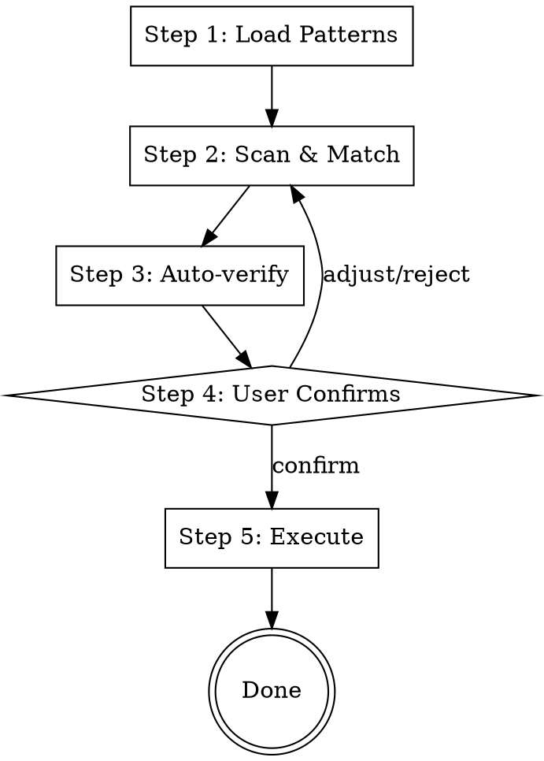

# Spec: dependency-migrator Skill Template

## Summary

A generic Skill template for code dependency migration. Through a user-maintained rule library (pattern + solution), it intelligently identifies old dependencies that need replacement in code, confirms with the user, and executes the replacement. The workflow is fixed; extension only requires adding rule directories.

**This is a Skill pattern/template.** When applying to a specific technology (e.g., iOS Swift, Android Kotlin, React), the user fills in technology-specific details: SKILL.md frontmatter `description`, example rules, and context-specific trigger conditions.

## Architecture

```
dependency-migrator/
  SKILL.md                         # Skill body: five-step workflow
  README.md                        # Maintenance guide for human contributors
  scripts/
    load_patterns.py               # Read all pattern.md files, XML-wrapped merged output
    load_solutions.py              # Read solution.md by rule name, XML-wrapped merged output
    create_rule.py                 # Create new rule directory + template files
    templates/
      pattern-template.md          # Suggested pattern template
      solution-template.md         # Suggested solution template
  rules/
    _example/                      # Example rule (skipped by load_patterns)
      pattern.md
      solution.md
      examples/                    # Optional: code example files
        before.example
        after.example
```

## Workflow



### Step 1: Load Patterns

Call `python3 scripts/load_patterns.py` to get all pattern descriptions. The script traverses `rules/*/pattern.md` and outputs XML-wrapped merged content:

```xml
<rule name="rule-name-a">
[content of pattern.md]
</rule>

<rule name="rule-name-b">
[content of pattern.md]
</rule>
```

Directories starting with `_` (e.g., `_example`) are skipped.

### Step 2: Scan & Match

AI scans code in the current context using all pattern descriptions as matching criteria. For each match, collects:

- File location
- Matched code snippet
- Matched rule name

If no matches found, workflow ends here.

### Step 3: Auto-verify

For each match from Step 2, AI automatically loads the corresponding solution to cross-validate:

1. Call `python3 scripts/load_solutions.py <rule-name>...` with all matched rule names
2. Read each solution content. If a solution references code files, read them on demand
3. Cross-validate: use the solution's description to verify the match is accurate and the solution actually applies to the matched code
4. Discard false positives — only retain matches that pass validation

This step catches mismatches before they reach the user. If all matches are discarded, report that clearly.

### Step 4: User Confirms

User reviews verified matches (including proposed solution summary). Can:

- Confirm to proceed
- Skip a match
- Request scope adjustment

### Step 5: Execute

For confirmed matches, execute replacements. Solutions were already loaded in Step 3. Subagent dispatch is optional, not enforced.

`load_solutions.py` output format (used in Step 3):

```xml
<solution name="rule-name-a">
[content of solution.md]
</solution>
```

## Scripts

### load_patterns.py

- **Input:** No arguments
- **Behavior:** Traverse all subdirectories under `rules/`, read `pattern.md`, skip directories starting with `_`
- **Output:** XML-wrapped merged content, each rule wrapped in `<rule name="...">`
- **Location:** Script is in the `scripts/` directory, uses `Path(__file__)` to locate `rules/` relative to skill root
- **Runtime:** Python 3.11+ (cross-platform: Windows, macOS, Linux)

### load_solutions.py

- **Input:** One or more rule names as positional arguments
- **Behavior:** Look up `rules/<name>/solution.md` by name
- **Output:** XML-wrapped merged content, each solution wrapped in `<solution name="...">`
- **Error handling:** Report error if rule name does not exist

### create_rule.py

- **Input:** A rule name as positional argument
- **Behavior:**
  1. Create `rules/<name>/` directory
  2. Generate `pattern.md` and `solution.md` from templates (replacing `[Rule Name]` with actual name)
  3. Error if directory already exists, do not overwrite

## Templates

Templates are **suggested but not enforced**. Users may write pattern.md and solution.md in any format they prefer.

### pattern-template.md

```markdown
# [Rule Name]

## Match Conditions
Describe what kind of code should be matched.

## Exclusion Conditions (optional)
Describe what should NOT be matched.

## Notes (optional)
Context information to pay special attention to when matching.
```

### solution-template.md

```markdown
# [Rule Name] - Replacement Solution

## Replacement Steps
Step-by-step description of how to execute the replacement.

## Before / After Examples
(Write code directly in Markdown, or reference files under examples/)

## Edge Cases (optional)
How to handle special scenarios.

## Notes (optional)
Common pitfalls during replacement.
```

## Code File References

solution.md can reference code files within the rule directory (e.g., `examples/before.ext`, `examples/after.ext`). AI reads solution first, then decides whether to load referenced code files on demand. Code files are optional.

## Extension

Adding new rules only requires:

1. Run `python3 scripts/create_rule.py <new-rule-name>` to generate templates
2. Edit `pattern.md` and `solution.md`
3. Optionally add `examples/` directory with code samples
4. No changes to SKILL.md or scripts needed

## Template Customization Checklist

When applying this template to a specific technology, fill in:

- [ ] SKILL.md frontmatter `name` and `description` with technology-specific triggers
- [ ] SKILL.md "When to Use" section with technology-specific scenarios
- [ ] Replace `_example/` rules with real technology-specific example rules
- [ ] Update code file extensions in examples (e.g., `.swift`, `.kt`, `.tsx`)
