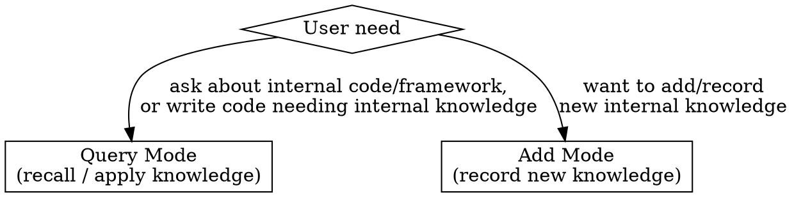
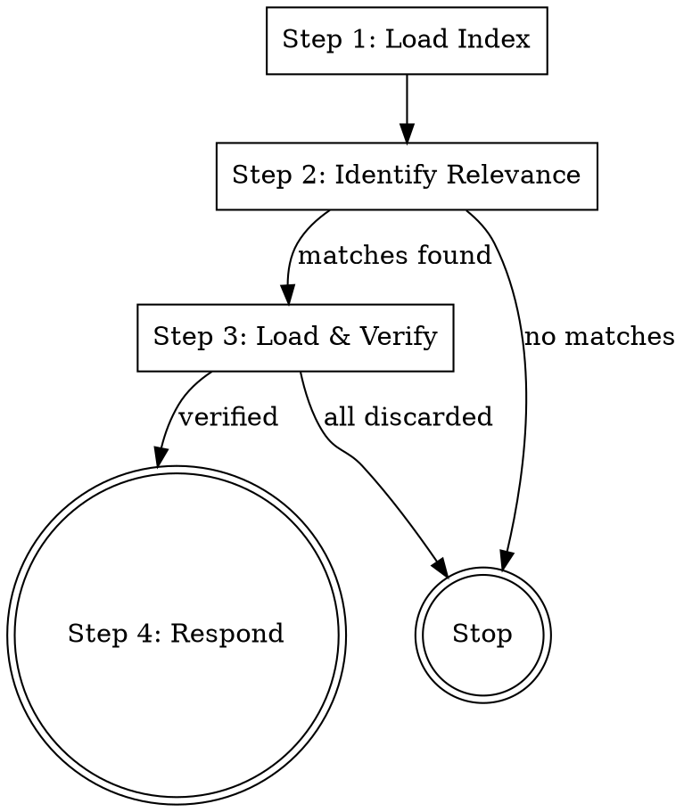
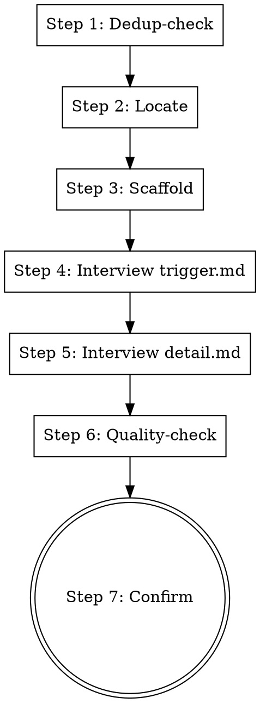

# Enterprise Knowledge

## Overview

A queryable knowledge base for enterprise internal code and frameworks. Knowledge lives in a structured library under `knowledge/` (each entry = `trigger.md` + `detail.md`). This skill has two fixed modes: a **Query Mode** that surfaces relevant knowledge, and an **Add Mode** that interviews you to author new entries.

**Core principle:** The workflows below are fixed. Knowledge grows only by adding entries under `knowledge/`. Never edit SKILL.md or the scripts to add knowledge.

## When to Use



Pick **Query Mode** when the user asks about internal frameworks/APIs/conventions, or when code is being written and internal knowledge is needed.
Pick **Add Mode** when the user wants to record or add new internal knowledge.

## Query Mode



**Violating the letter of this workflow is violating the spirit of this skill.**

### Step 1: Load Index

Call `python scripts/load_index.py` (from the skill directory). This recursively reads all `knowledge/**/trigger.md` (skipping any path component starting with `_`) and returns XML-wrapped merged output.

```
<entries count="N">
<entry name="frameworks/spring-boot">
[trigger.md content]
</entry>
...
</entries>
```

Do NOT skip this step. The script output is the authoritative source of what knowledge exists. Do not rely on memory or guess.

### Step 2: Identify Relevance

Using all triggers from Step 1 as match criteria, identify relevant entries. Both paths are valid:

- **Proactive:** scan code in the current context for patterns described in triggers (imports, API calls, keywords, config).
- **Reactive:** match the user's question or intent against triggers.

Collect the path-names of hit entries (e.g., `frameworks/spring-boot`). Be thorough — do not stop at the first match.

If no entry matches, report that clearly — Query Mode ends here. Do not fabricate knowledge that is not in the library.

### Step 3: Load & Verify

For all matched entries:

1. Call `python scripts/load_details.py <entry-name>...` with all matched path-names.
2. Read each detail. If it references code files (e.g., `examples/correct.ext`), read them on demand.
3. Cross-validate: use the detail to confirm the entry genuinely applies to the matched context.
4. **Discard false positives** — only retain entries that pass validation.

Do NOT skip this step. Raw trigger matching is too loose; detail context is required to confirm applicability. If all entries are discarded, report that clearly.

### Step 4: Respond

Use the verified knowledge to answer the query, or proactively surface applicable knowledge: cite entry names, file locations, code snippets, and concrete recommendations.

This skill **presents and advises**. It does not edit code. If changes are warranted, describe them and let the user (or another skill) apply them.

## Add Mode



### Step 1: Dedup-check

Call `python scripts/load_index.py` and review existing triggers. If similar knowledge already exists, ask the user whether to extend an existing entry or create a new one.

### Step 2: Locate

Determine what the knowledge is and which category it belongs to (existing category or a new one under `knowledge/`).

### Step 3: Scaffold

Run `python scripts/create_entry.py <category>/<entry-name>` to generate `trigger.md` and `detail.md` from templates.

### Step 4: Interview trigger.md (item-by-item)

Interview the user one item at a time and write `trigger.md`:
- **Applicable scenarios:** which APIs/classes/methods/keywords signal relevance? Be specific.
- **Queries hit:** which questions should this entry answer?
- **Exclusion conditions:** what should NOT be matched?
- **Notes:** confusable points (similar APIs to distinguish).

Ask one question at a time. Write concrete content, not placeholders.

### Step 5: Interview detail.md (item-by-item)

Interview the user one item at a time and write `detail.md`:
- **Overview:** what is this and why it matters (1-2 sentences).
- **Usage / conventions:** the correct way to use it.
- **Code examples:** correct (and optionally incorrect) usage; may go under `examples/`.
- **Common pitfalls:** what is easy to get wrong.
- **References:** links or related entries.

Ask one question at a time. Capture real examples from the user.

### Step 6: Quality-check

Before finishing, verify:
- Trigger is **specific** (not vague like "applies to X").
- Detail is **complete** (overview + usage + at least one example).
- Examples are **accurate** and consistent with the trigger.
- Trigger and detail **agree** (the match conditions actually lead to this detail).

Fix gaps inline.

### Step 7: Confirm

Show the user the generated `trigger.md` and `detail.md`. Let them review and request adjustments.

## Common Mistakes

| Mistake | Fix |
|---------|-----|
| Skipping Step 1 (Query) and answering from memory | Always run load_index.py first |
| Skipping Step 3 (Query) and presenting unverified matches | Always load details and cross-validate |
| Fabricating knowledge not in the library | Only answer from loaded entries; if absent, say so |
| In Add Mode, writing placeholders instead of real content | Interview the user; capture concrete specifics |
| In Add Mode, creating vague triggers ("applies to auth") | Demand specific APIs/keywords/queries |
| Editing SKILL.md or scripts to add knowledge | Only add directories under knowledge/ |
