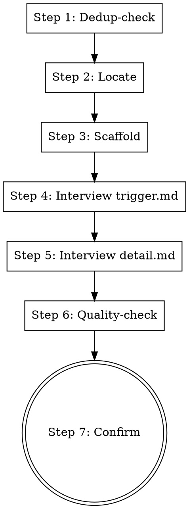

# Add Mode (Reference)

Loaded on demand by SKILL.md when the user wants to record or add new internal knowledge. This file is intentionally kept out of SKILL.md so the primary Query workflow stays lean.

## Workflow

**Violating the letter of this workflow is violating the spirit of this skill.**

### Step 1: Dedup-check

Call `python scripts/load_index.py` and review existing triggers. If similar knowledge already exists, ask the user whether to extend an existing entry or create a new one.

### Step 2: Locate

Determine what the knowledge is and which category it belongs to (existing category or a new one under `knowledge/`).

### Step 3: Scaffold

Run `python scripts/create_entry.py <category>/<entry-name>` to generate `trigger.md` and `detail.md` from templates.

### Step 4: Interview trigger.md (item-by-item)

Interview the user one item at a time and write `trigger.md`:
- **Applicable scenarios:** which APIs/classes/methods/keywords signal relevance? Be specific.
- **Queries hit:** which questions should this entry answer?
- **Exclusion conditions:** what should NOT be matched?
- **Notes:** confusable points (similar APIs to distinguish).

Ask one question at a time. Write concrete content, not placeholders.

### Step 5: Interview detail.md (item-by-item)

Interview the user one item at a time and write `detail.md`:
- **Overview:** what is this and why it matters (1-2 sentences).
- **Usage / conventions:** the correct way to use it.
- **Code examples:** correct (and optionally incorrect) usage; may go under `examples/`.
- **Common pitfalls:** what is easy to get wrong.
- **References:** links or related entries.

Ask one question at a time. Capture real examples from the user.

### Step 6: Quality-check

Before finishing, verify:
- Trigger is **specific** (not vague like "applies to X").
- Detail is **complete** (overview + usage + at least one example).
- Examples are **accurate** and consistent with the trigger.
- Trigger and detail **agree** (the match conditions actually lead to this detail).

Fix gaps inline.

### Step 7: Confirm

Show the user the generated `trigger.md` and `detail.md`. Let them review and request adjustments.

## Common Mistakes

| Mistake | Fix |
|---------|-----|
| Writing placeholders instead of real content | Interview the user; capture concrete specifics |
| Creating vague triggers ("applies to auth") | Demand specific APIs/keywords/queries |
| Skipping dedup-check and duplicating existing knowledge | Always run load_index.py first in Step 1 |
