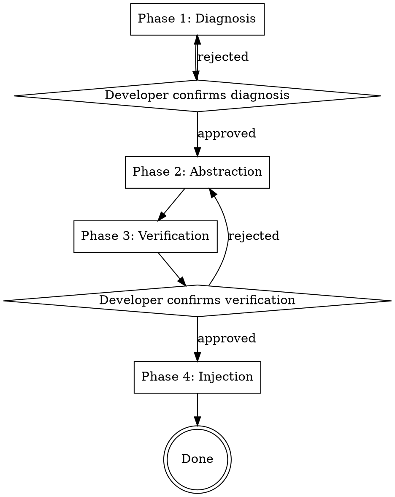

# Evolving Skill Rules

## Overview

**Never patch a skill for a specific case. Always abstract the failure into a generalizable rule.**

Core principle: every failure case is a signal that the skill lacks a rule. The fix is not to memorize the case, but to extract the underlying logic the skill was missing.

This skill guides you through a four-phase gated workflow to diagnose failures, abstract them into reusable rules, verify generalization, and inject them back into the skill with version tracking.

**Violating the letter of this process is violating the spirit of skill evolution.**

## When to Use

> **Important:** This skill should ONLY be invoked when the user explicitly asks to review/evolve a skill's rules (复盘skill). General bug reports and code corrections do NOT trigger this skill.

- A skill produced incorrect output on a specific input
- A skill missed an edge case that seems obvious in hindsight
- A skill's rule was interpreted differently than intended
- You found yourself saying "it should have known to do X in this case"
- Post-mortem analysis of a skill failure

**Do NOT use when:**

- The failure is due to a bug in the skill's supporting code (fix the code, not the rule)
- The failure is a one-off environmental issue (network, permissions, etc.)

## The Iron Law

```
NO CASE-SPECIFIC PATCHES. EVERY FIX MUST BE A GENERALIZED RULE.
```

If the new rule only applies to the triggering case, it is not a rule — it is memorization. Start over.

## The Four Phases



Each phase MUST complete before proceeding. You cannot skip phases. Gates require explicit developer confirmation.

---

### Phase 1: Diagnosis

**Collect from developer:**

1. Path to the target SKILL.md
2. The specific case input
3. The actual (incorrect) output the skill produced
4. The expected (correct) output

**Execute:**

1. Read the full target SKILL.md
2. Compare actual vs expected output — locate the exact deviation point
3. Search SKILL.md for any existing rule that should have covered this scenario
4. Classify the failure:

| Classification   | Signal                                                                         | Example                                                               |
| ---------------- | ------------------------------------------------------------------------------ | --------------------------------------------------------------------- |
| `missing_rule`   | No rule in SKILL.md covers this scenario at all                                | Skill never mentions how to handle empty input                        |
| `ambiguous_rule` | A related rule exists but its wording allows multiple interpretations          | "Handle errors" without specifying which errors or how                |
| `knowledge_gap`  | Rule exists and is clear, but lacks domain-specific details needed to apply it | Rule says "validate format" but doesn't define what valid formats are |

**Gate:** Present diagnosis to developer:

- The deviation point
- The classification with reasoning
- The specific section of SKILL.md that is relevant (or note its absence)

Wait for developer confirmation before proceeding. If developer rejects, re-analyze.

---

### Phase 2: Abstraction

**This is the core phase.** Do not rush it.

Use the following prompt template to drive the abstraction. Apply it to the specific failure case:

#### Abstraction Prompt

```
Given a specific failure case:
- Case input: [specific input]
- Actual output: [what the skill produced]
- Expected output: [what should have been produced]
- Failure classification: [missing_rule | ambiguous_rule | knowledge_gap]
- Current SKILL.md content: [full text]

Generate a generalized rule by performing ALL five steps:

STEP 1 — ENTITY EXTRACTION
List every case-specific entity in the input/output:
- Specific names (people, projects, companies)
- Specific values (numbers, IDs, paths)
- Specific technology (framework versions, library names)
- Specific domain terms (project-internal jargon)

STEP 2 — GENERALIZATION
For each entity, determine its abstract category:
- "John Smith" → "a team member with a specific role"
- "port 8080" → "a configured service port"
- "React 18.2" → "the target UI framework"
- "PROJ-1234" → "a project identifier"

STEP 3 — LOGIC EXTRACTION
What is the underlying decision logic that was missing?
Express it WITHOUT any of the original entities.

STEP 4 — RULE FORMULATION
Write a clear, actionable rule using only categories.
The rule should read as if it was written before the case existed.

STEP 5 — SCOPE DEFINITION
Define precisely when this rule applies:
- What category of inputs triggers it?
- What category of situations does it cover?
- What is explicitly OUT of scope?
```

**Output format — use this exact structure:**

```markdown
### New Rule: [descriptive-rule-name]

**Classification**: missing_rule | ambiguous_rule | knowledge_gap
**Scope**: [when this rule applies — category of scenarios]
**Rule Text**: [the generalized rule — no case-specific entities]
**Replaced Entities**: [original entity → abstract category]
```

**De-specialization Checklist — verify ALL items before output:**

| Check                                                           | Action if Failed                             |
| --------------------------------------------------------------- | -------------------------------------------- |
| Contains specific person/project names?                         | Replace with roles/types                     |
| Contains hardcoded numbers?                                     | Replace with conditional descriptions        |
| Contains technology-specific terms (non-universal)?             | Replace with technology categories           |
| Contains domain-specific jargon without definition?             | Define the term or use a generic alternative |
| Rule reads like "when X happens to Y, do Z" (X/Y are specific)? | Generalize X and Y                           |
| Rule would NOT apply to a different case in the same category?  | Broaden the rule's scope                     |

If ANY check fails, re-run the abstraction before presenting to developer.

---

### Phase 3: Verification

**Two-step verification. Both must pass.**

**Step 1 — Automated Self-Check:**

- Compare the generated rule's "Replaced Entities" list against the rule text
- Scan for any entity-specific terms from the original case that leaked through
- If found → return to Phase 2, flag the leak, re-abstract

**Step 2 — Cross-Case Validation (developer-executed):**
Ask the developer to:

1. Construct a **different** case in the same category (same type of scenario, different specific data)
2. Read the new rule and determine: would this rule correctly guide behavior for the new case?
3. If NO → return to Phase 2 with feedback on what's too narrow

**Gate:** Developer explicitly confirms the rule passes both checks.

---

### Phase 4: Injection & Version Management

**Step 1 — Initialize Git (if needed):**

```bash
bash <this-skill's-directory>/scripts/init-skill-repo.sh <skill-directory>
```

`<this-skill's-directory>` = the directory containing this SKILL.md file. The script is at `scripts/init-skill-repo.sh` relative to that directory.

This script:

- Validates the directory contains SKILL.md
- Initializes a git repo if one doesn't exist
- Makes an initial commit of the current state

**Step 2 — Determine Injection Point:**

| Classification   | Where to Inject                                                       |
| ---------------- | --------------------------------------------------------------------- |
| `missing_rule`   | Add to the "Core Pattern", "Implementation", or most relevant section |
| `ambiguous_rule` | Replace or enhance the existing ambiguous rule in-place               |
| `knowledge_gap`  | Append detailed knowledge right after the relevant existing rule      |

**Step 3 — Execute Injection:**

1. Read the current SKILL.md
2. Insert the rule text at the determined location
3. If no `## Changelog` section exists, append one at the end
4. Add a changelog entry:

```markdown
## Changelog

| Date       | Type             | Rule        | Trigger Case Category   | Scope             |
| ---------- | ---------------- | ----------- | ----------------------- | ----------------- |
| YYYY-MM-DD | [classification] | [rule name] | [generalized case type] | [when it applies] |
```

**Step 4 — Git Commit:**

```bash
git add SKILL.md && git commit -m "rule: <rule-name> - <classification> - <brief-why>"
```

**Important:** The git repo is local-only. Do NOT push to any remote. This version history exists solely for local rollback and change tracking.

---

## Quick Reference

| Phase           | Input                    | Output                                   | Gate                                   |
| --------------- | ------------------------ | ---------------------------------------- | -------------------------------------- |
| 1. Diagnosis    | Case I/O + SKILL.md      | Failure classification + deviation point | Developer confirms diagnosis           |
| 2. Abstraction  | Diagnosis + case details | Generalized rule + entity mapping        | De-specialization checklist passes     |
| 3. Verification | Generalized rule         | Verified rule                            | Developer confirms cross-case validity |
| 4. Injection    | Verified rule + SKILL.md | Updated SKILL.md + git commit            | Commit succeeds                        |

## Common Mistakes

| Mistake                                          | Fix                                                             |
| ------------------------------------------------ | --------------------------------------------------------------- |
| Rule still mentions the specific case's entity   | Re-run Phase 2, check de-specialization list item by item       |
| Rule is too abstract and loses actionable detail | Narrow scope, add concrete conditionals without specific values |
| Skipping cross-case validation                   | You MUST construct a different case. No exceptions.             |
| Injecting at wrong location in SKILL.md          | Follow the classification-based injection table in Phase 4      |
| Forgetting to initialize git for the skill       | Run init-skill-repo.sh before any injection                     |
| Adding changelog without all required fields     | Every column in the changelog table is mandatory                |

## Red Flags — STOP and Re-abstract

- The rule reads like a description of the specific case
- You can substitute the original case's entities back into the rule and it stops making sense
- The scope description mentions anything from the original case
- The rule uses "this" or "the above" referring to the triggering case
- You think "this is close enough" — it's not

## Rationalization Prevention

| Excuse                                       | Reality                                                                  |
| -------------------------------------------- | ------------------------------------------------------------------------ |
| "The rule is close enough"                   | Close enough = case-specific. Re-abstract.                               |
| "This case is unique, no need to generalize" | If it happened once, it will happen again. Abstract it.                  |
| "Cross-case validation takes too long"       | 2 minutes of validation saves hours of narrow rules.                     |
| "I'll verify after injection"                | Verify before. Injecting unverified rules contaminates the skill.        |
| "The entity is generic enough"               | If it came from the case, it's specific. Replace it.                     |
| "This is too simple for the full process"    | Simple cases produce the sneakiest case-specific rules. Use the process. |
