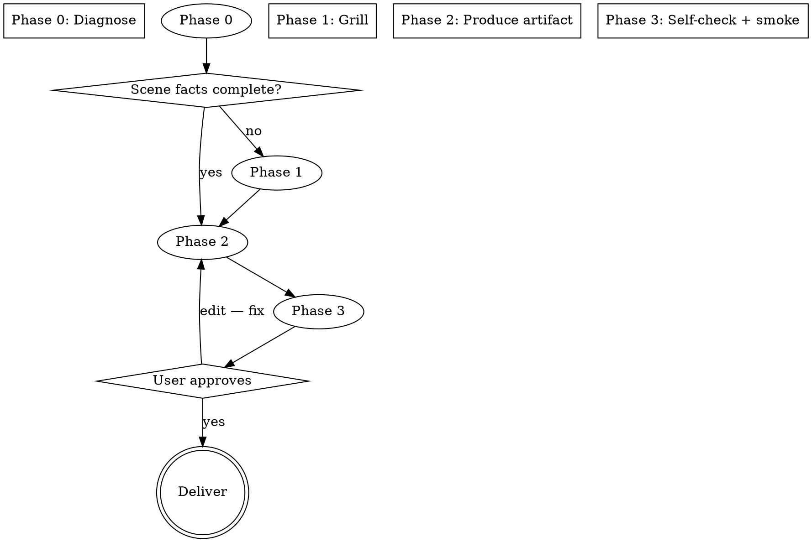

# Migration Reviewer — Generate

## Overview

> 目标是一份按**真实场景**诊断出的迁移 review 检查规程，不是通用模板的填空。

Guides producing a scenario-specific migration-review artifact (checklist, skill, or rule) from the actual migration scene, built on the six-part methodology. Diff cannot see what was deleted; the review is about behaviour preservation, not syntax.

## When to use

- Create a reusable migration-review **skill** for one concrete scene (e.g. "Python → Go API rewrite", "React class → hooks").
- Extend an **existing skill** with a migration-review rule/checklist section.
- Add a migration-review **topic/persona** to an agent.
- Produce a one-off migration checklist for a team.

If the user instead wants to run the review on real before/after code right now, that is `migration-reviewer-audit`'s job — route it there.

## Iron rule

```
NO checklist, NO document, NO skill — until the scene is grounded from the user's actual facts.
```

Grounded = source → target, scope (which module/work unit), and evidence type (old tests, fixtures, runnable legacy) are confirmed from the user or inferred from their context and explicitly re-stated. Do not proceed on assumption. If a fact is genuinely optional, say so, give a recommended default, and mark it.

**No exceptions — no "verified from memory", no "obvious from the project name".**

## Flow



### Phase 0 — Diagnose (from context)

Pull everything you can from the user's own words before asking anything:

1. **Parse facts**: source → target, scope (module / service / workflow), desired artifact.
2. **Classify the migration type** — it decides which behaviour categories the checklist must stress:
   - Cross-language rewrite — types & numeric precision, locale/date/time, unicode, concurrency model, exception semantics.
   - Framework upgrade (React, Django, Spring…) — lifecycle/hooks, DI, config, deprecation behaviour.
   - Service split / monolith → services — API contract, data ownership, event timing, shared mutable state.
   - DB → application layer — stored-proc semantics, NULL/default, transactions, rounding, trigger logic.
   - Library → new vendor / API — dependency surface, error codes, data shape.
   - Adapter relocation / re-host (framework adapter moved from App A to App B) — partition `portable core` (must stay byte-identical to legacy) vs `host glue` (must conform to host B's rules, never to legacy A's); sweep for legacy-A residue in B.
3. **List what is NOT settled** — the gaps become Phase 1 questions.
4. **Pick the artifact form** the scene calls for:
   - standalone skill → `assets/skill-template.md`
   - a rule/checklist block inside an existing skill → `assets/rule-template.md`
   - an agent topic/persona → `assets/agent-topic-template.md`

### Phase 1 — Grill (ground with the user)

Ask only what Phase 0 could not settle, one question at a time, each with a recommended answer. Restate inferred facts first so the user can confirm or correct.

- **Scope** — which paths/packages; which explicitly out of scope.
- **Evidence** — old tests runnable? golden corpus? does legacy run in this environment? production traffic available? → this fixes the reachable verification tier. **Existing Business Rules Inventory** (CoreStory Phase 2 spec or similar)? If yes, the artifact checks *against* it instead of rebuilding it.
- **Artifact form** — standalone `migration-review-<name>/` skill, rule section inside an existing skill, agent topic, or a one-off CLI checklist.

Where scope implies risk (ask only if the scene leaves it open):

- **Risk you fear** — payments, state machine, timezones, rounding… → that logic gets the highest verification tier.
- **Consumer contracts** — does any external caller parse error text / status codes / ordering? (hidden behaviour tier)
- **Adapter relocation only** — who owns the host glue's spec: host B's rules doc, B's framework conventions, or nothing (then MUST be produced)? Is the portable core truly host-free, or does an A-ism hide inside it? (two-oracle split)
- **Data movement** — is data migrating, and must it be lossless? → Tier 4 reconciliation.
- **Language** — Chinese / English / bilingual (default matches the user's language).

**Gate:** core facts (source → target, scope, evidence) confirmed.

### Phase 2 — Produce

1. Load `references/methodology.md` (the six-part spine) plus the matching template from `assets/`.
2. Build the artifact: name, trigger description, scope, **migration-type-specific** checklist, reachable verification tier, gates — grounded in the confirmed scene.
3. Do **not** inline the whole methodology — link to `references/`. Keep the artifact short enough to scan per review run.

### Phase 3 — Self-check + smoke

1. Run `references/self-check.md` against the artifact; fix every finding.
2. **Smoke** — if the scene includes real before/after file pairs, apply the checklist to one small real slice (one function, one pair of files) and confirm it yields concrete findings, not generic statements. No real pairs → state that explicitly, then run the slice on one synthetic example as a stand-in. For a reusable offline regression, use `assets/smoke-example/run-smoke.ps1`.

3. Present for sign-off.

**Gate:** user approves. Signals you approved too early: the smoke produced zero real findings, or the checklist is the six generic categories verbatim instead of the type-specific list.

## Common mistakes

| Mistake | Fix |
|---|---|
| The template ends up in the artifact | Checklist is written from the scene; template is only the skeleton |
| One same list for all migration types | The migration type (Phase 0) drives the categories |
| Saying "the scene is obvious, I'll fill it in" | Ground first, one question at a time |
| Verification tier invented | Tier derived from evidence the user actually stated |
| Artifact is the six pieces with no type flavour | Type-specific rows are present in its checklist |
| Only one artifact form considered | Skill / rule section / agent topic / one-shot checklist are all valid |

## Danger signals — stop and rework

- No grounded scene (invented source → target or evidence).
- Checklist = the generic six categories with no type-specific rows.
- Verification tier missing, or a tier the user said is unreachable.
- Human gate missing from a report when one is expected.
- Smoke produced zero real findings but you still signed off.

## Quick reference

| Phase | Output | Gate |
|---|---|---|
| 0 Diagnose | scene facts: source/target, type, artifact form | — |
| 1 Grill | remaining facts confirmed | scene grounded |
| 2 Produce | checklist / skill / rule / topic artifact | — |
| 3 Self-check + smoke | DoD passed; mini audit evidences real findings | user approval |

## References

- `references/methodology.md` — the six-part methodology (inventory → rules → classification → hidden behaviours → verification → report).
- `references/diagnosis-guide.md` — scene classification (migration type, artifact form) + grill question tree.
- `references/self-check.md` — DoD checklist + smoke procedure for Phase 3.
- `assets/skill-template.md` — standalone skill skeleton.
- `assets/rule-template.md` — a review-rule block to append to an existing skill.
- `assets/agent-topic-template.md` — migration-review topic/persona section for an agent.
- `assets/smoke-example/` — a runnable regression (fixtures + `run-smoke.ps1`) for Phase 3.

Running the review itself on live before/after code belongs to `migration-reviewer-audit`.