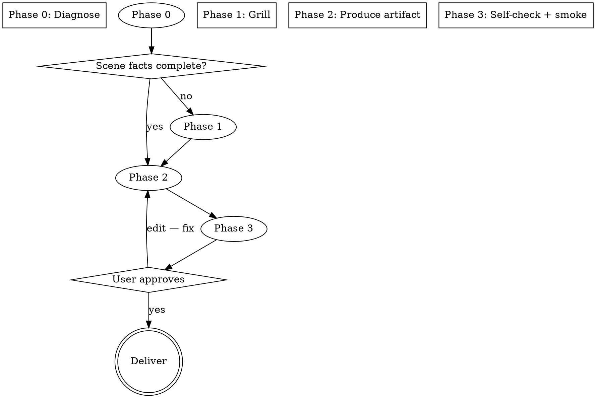

# Migration Reviewer — Generate

## Overview

> 目标是一份按**真实场景**诊断出的迁移 review 检查规程，不是通用模板的填空。

Guides producing a scenario-specific migration-review artifact (checklist, skill, or rule) for an **adapter relocation / re-host (A6)** — the same adapter moved from host App A to host App B. Diff cannot see what was deleted, and in a re-host the diff logic partly inverts: glue that *diverged* from A is often the correct outcome. The review is about behaviour preservation (core) and contract conformance (glue), not syntax.

## When to use

- Create a reusable migration-review **skill** for one concrete re-host scene (e.g. "payment adapter from App ATLAS to App ORB").
- Extend an **existing skill** with an adapter-relocation review rule/checklist section.
- Add an adapter-relocation review **topic/persona** to an agent.
- Produce a one-off re-host checklist for a team.

If the user instead wants to run the review on real before/after code right now, generate the checklist from the scene first, then apply it to that slice — the in-place review is exactly the Phase 3 smoke.

## Iron rule

```
NO checklist, NO document, NO skill — until the scene is grounded from the user's actual facts.
```

Grounded = source → target, scope (which module/work unit), and evidence type (old tests, fixtures, runnable legacy) are confirmed from the user or inferred from their context and explicitly re-stated. Do not proceed on assumption. If a fact is genuinely optional, say so, give a recommended default, and mark it.

**No exceptions — no "verified from memory", no "obvious from the project name".**

## Flow



### Phase 0 — Diagnose (from context)

Pull everything you can from the user's own words before asking anything:

1. **Parse facts**: host A → host B, scope (which adapter module + glue paths), desired artifact.
2. **Confirm the A6 shape** — the scene is adapter relocation / re-host only if: the same adapter module moves, the host changes App A → App B, and the framework-facing side of the adapter is unchanged. Anything else (language rewrite, framework upgrade, service split, DB→app, library swap) is NOT this skill's scene — say so and stop; do not force the checklist onto it.
3. **Partition the scene from the code** (three zones; see `references/diagnosis-guide.md`):
   - *pure core logic* — oracle: the legacy core. Per-line heuristic: "would this line change if the host were C (a third host)?" No → core.
   - *acquisition seams in the core* (env/config keys, DI, clock, downstream providers) — the heuristic says "yes, it would change" → seam. Enumerate seams by **scanning the code** (imports of host facilities, env/config reads, DI lookups, clock calls, downstream endpoints) — the category list is a prompt, what counts as a seam is decided by this scene's code — then confirm the list with the user. Each seam becomes a `RE-POINTED` verify row.
   - *host glue* — oracle: host B's contract. If B's contract isn't written down, producing it is a prerequisite deliverable.
4. **List what is NOT settled** — the gaps become Phase 1 questions.
5. **Pick the artifact form** the scene calls for:
   - standalone skill → `assets/skill-template.md`
   - a rule/checklist block inside an existing skill → `assets/rule-template.md`
   - an agent topic/persona → `assets/agent-topic-template.md`

### Phase 1 — Grill (ground with the user)

Ask only what Phase 0 could not settle, one question at a time, each with a recommended answer. Restate inferred facts first so the user can confirm or correct.

- **Scope** — which paths/packages; which explicitly out of scope.
- **Evidence** — old tests runnable? golden corpus? does legacy run in this environment? production traffic available? → this fixes the reachable verification tier. **Existing Business Rules Inventory** (CoreStory Phase 2 spec or similar)? If yes, the artifact checks *against* it instead of rebuilding it.
- **Artifact form** — standalone `migration-review-<name>/` skill, rule section inside an existing skill, agent topic, or a one-off CLI checklist.

Where scope implies risk (ask only if the scene leaves it open):

- **Risk you fear** — payments, ordering guarantees, state machine, validation rules… → that core logic gets the highest verification tier.
- **Consumer contracts** — does any external caller parse error text / status codes / ordering? (hidden behaviour tier)
- **B's contract** — does host B's rules doc / conventions / sibling adapters in B exist? If not, producing the contract is a prerequisite deliverable.
- **Data movement** — is data migrating, and must it be lossless? → Tier 4 reconciliation.
- **Language** — Chinese / English / bilingual (default matches the user's language).

**Gate:** core facts (source → target, scope, evidence) confirmed.

### Phase 2 — Produce

1. Load `references/methodology.md` (the six-part spine) plus the matching template from `assets/`.
2. Build the artifact: name, trigger description, scope, **A6-specific** checklist (partition zones, `RE-POINTED` seam rows, B-touchpoint conformance, A-residue sweep), reachable verification tier, gates — grounded in the confirmed scene.
3. Do **not** inline the whole methodology — link to `references/`. Keep the artifact short enough to scan per review run.

### Phase 3 — Self-check + smoke

1. Run `references/self-check.md` against the artifact; fix every finding.
2. **Smoke** — if the scene includes real before/after file pairs, apply the checklist to one small real slice (one function, one pair of files) and confirm it yields concrete findings, not generic statements. No real pairs → state that explicitly, then run the slice on one synthetic example as a stand-in. For a reusable offline regression, use `assets/smoke-example/run-smoke.ps1`.

3. Present for sign-off.

**Gate:** user approves. Signals you approved too early: the smoke produced zero real findings, or the checklist is the six generic categories verbatim instead of the A6-specific rows.

## Common mistakes

| Mistake | Fix |
|---|---|
| The template ends up in the artifact | Checklist is written from the scene; template is only the skeleton |
| One oracle for core and glue | Core → legacy-core oracle; glue → B-contract oracle; never mixed |
| Seam change flagged as a regression | A seam re-pointed to B is a `RE-POINTED` verify row, not `DIFFERS` |
| Glue divergence from A reported as a bug | Divergence from A while conforming to B is `INTENDED` |
| Seam list written from memory | Enumerate seams by scanning the code, then confirm with the user |
| Verification tier invented | Tier derived from evidence the user actually stated |
| Only one artifact form considered | Skill / rule section / agent topic / one-shot checklist are all valid |

## Danger signals — stop and rework

- Scene is not adapter relocation (some other migration type) and you proceeded anyway.
- No partition: scope lines not assigned to core / seam / glue.
- Byte-identity claimed for the core without a byte-oracle harness (and zero host coupling).
- Glue audited against legacy A's glue instead of B's contract.
- B's contract missing and nobody flagged it as a prerequisite deliverable.
- Verification tier missing, or a tier the user said is unreachable.
- Smoke produced zero real findings but you still signed off.

## Quick reference

| Phase | Output | Gate |
|---|---|---|
| 0 Diagnose | A6 scene confirmed: hosts, adapter scope, partition, artifact form | — |
| 1 Grill | remaining facts confirmed (seams, B contract, evidence) | scene grounded |
| 2 Produce | checklist / skill / rule / topic artifact | — |
| 3 Self-check + smoke | DoD passed; mini audit evidences real findings | user approval |

## References

- `references/methodology.md` — the six-part methodology (inventory → rules → classification → hidden behaviours → verification → report) + the dual-oracle overlay for re-host.
- `references/diagnosis-guide.md` — A6 scene confirmation + partition, artifact form, grill question tree.
- `references/self-check.md` — DoD checklist + smoke procedure for Phase 3.
- `assets/skill-template.md` — standalone skill skeleton.
- `assets/rule-template.md` — a review-rule block to append to an existing skill.
- `assets/agent-topic-template.md` — migration-review topic/persona section for an agent.
- `assets/report-template.md` — Behavioral Equivalence Report template (copied into a generated skill's `assets/`).
- `assets/smoke-example/` — a runnable regression (fixtures + `run-smoke.ps1`) for Phase 3.

The generated artifact is what runs on live before/after code — this skill's job ends when the artifact is approved.