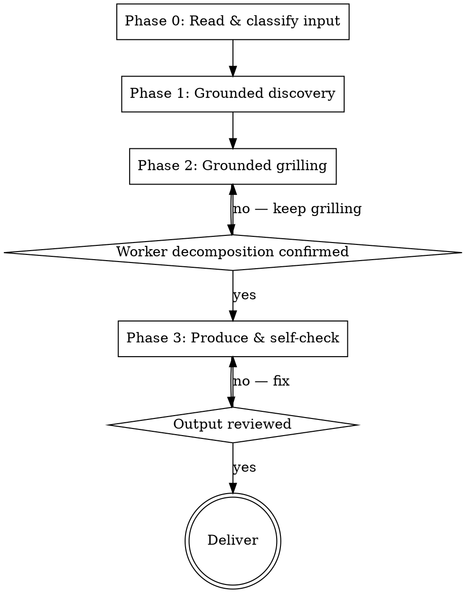

# orchestrating-subagents

## Overview

Turn any input into a **VS Code subagent orchestration**: one coordinator `.agent.md` that delegates to specialized worker `.agent.md` files, each with its own tools, model, and isolated context.

> This skill is **manual-only** (`disable-model-invocation: true`). It is never auto-loaded by relevance — the user invokes it via the `/orchestrating-subagents` slash command. If you are reading this, the user explicitly asked for it.

This skill works by **grounded grilling**. It does not fire questions cold. It first reads the input, loads the orchestration-pattern knowledge as a lens, forms a tentative design, and *then* interviews you one question at a time — each question carrying a recommended answer derived from that analysis. It is grill-me, but the questions come from actually knowing how subagent orchestration succeeds or fails.

**Violating the letter of these rules is violating the spirit of this skill.**

## When to use

- You have a task, prompt, or workflow and want it to run as a **coordinator + workers** setup in VS Code
- You want to split one overloaded agent into isolated-context specialists (research / plan / implement / review)
- You want parallel **multi-perspective** review or analysis with synthesis

**Do NOT use for:**

- A single agent that doesn't need delegation — just write the prompt
- Scaffolding an opencode skill (`SKILL.md` + `references/`) → use `skill-architect`
- Producing a workflow playbook (`flow.md` + `steps/`) → use `designing-workflows`
- A job a single LLM call can do — over-orchestration is the top failure mode here

> The two sibling skills above (`skill-architect`, `designing-workflows`) are **repo-local** — they exist in this repository but won't be installed on the GitHub Copilot host where this skill runs. Treat them as orientation only.

## Boundaries (vs. sibling skills)

| Skill | Output artifact | Platform |
|---|---|---|
| `orchestrating-subagents` (this) | coordinator + worker `.agent.md` | VS Code custom agents |
| `skill-architect` | one `SKILL.md` (+ `assets/`/`references/`) | opencode skills |
| `designing-workflows` | `flow.md` + `steps/` playbook | runtime playbook |

This skill is self-contained: it carries its own pattern knowledge and does not depend on the others.

## Iron rule

```
No .agent.md files are written until the worker decomposition is confirmed.
```

Worker decomposition is where every orchestration lives or dies — overlapping workers, over-granted tools, missing iteration loops all originate here. You must reach a confirmed worker set (names, responsibility, tools, model) before producing any file.

**No exceptions:**
- Not "the task is obvious, I'll just emit the files"
- Not "I'll infer the workers and note them as defaults"
- Not "the user is in a hurry, ship a draft"
- If no user is available to confirm (e.g. called as a one-shot tool), state explicitly that this skill requires interactive review of the worker decomposition, and surface your proposed decomposition for confirmation rather than writing files.

## The two core patterns (names only — details load on demand)

1. **Coordinator + Worker** — a coordinator drives a multi-stage flow and delegates each stage to a specialist worker (read-only Planner/Architect/Reviewer, write Implementer). Best for build/refactor pipelines with iteration.
2. **Multi-perspective parallel review** — one reviewer fans out N independent perspectives in parallel, then synthesizes. Best for review/analysis where bias independence matters.

Variants (multi-model consensus, recursive divide-and-conquer, research-then-implement, parallel analysis fan-out) and the decision tree live in `references/pattern-catalog.md`. **Load it in Phase 1.**

## Four-phase flow (gated)



Each phase must complete before the next. Gates require **explicit** user confirmation.

### Phase 0 — Read & classify input

Read the input fully. Classify it as one of:

- **(a) Goal/task description** — "build a feature builder that plans + implements + reviews"
- **(b) Existing single-agent prompt** — a monolithic instruction to be split into coordinator + workers
- **(c) Existing workflow document** — phases to map onto workers

For (b): identify what the single agent does and which parts could be delegated to isolated context. For (c): map each existing phase to a candidate worker. **Do not explore the codebase unless the user explicitly asks.** No questions yet — only understanding.

### Phase 1 — Grounded discovery

Load `references/pattern-catalog.md`. Using the patterns as a lens, analyze the input and produce a **tentative design hypothesis**:

- Which pattern (or combination) fits, and why
- A candidate worker set (names + one-line responsibility each)
- Tool boundaries per worker (minimal privilege)
- Model routing (can any worker use a cheaper model?)
- Iteration points (where does review feed back into implementation?)
- Nesting needs (rare)

Also surface the **gaps** — the specific decisions the input does not resolve. These gaps become the grilling agenda. Load `references/discovery-guide.md` for the question tree.

### Phase 2 — Grounded grilling (gate)

Interview the user **one question at a time**, each with a recommended answer derived from the Phase 1 hypothesis. Walk the decision tree in order: pattern → worker decomposition → tool boundaries → model routing → iteration → nesting → invocation control → output location/filenames. Stop only when the worker decomposition is fully resolved.

- One question at a time. Multiple at once is bewildering.
- Always offer a recommended answer; never ask open-ended.
- Skip any branch the input or hypothesis already settles — don't ask questions you can answer.
- **Gate:** user confirms the worker decomposition (coordinator's `agents` list + each worker's responsibility / tools / model). Do not proceed to Phase 3 without it.

### Phase 3 — Produce & self-check

Load `assets/frontmatter-spec.md` and the templates (`assets/coordinator.agent.md`, `assets/worker.agent.md`). Generate one coordinator `.agent.md` plus one `.agent.md` per worker. Then load `references/self-check.md` and run the DoD checklist before showing the output.

- Write files to the user-chosen directory; confirm before overwriting.
- The coordinator's `agents:` list must equal the workers' `name` fields (not the filenames), exactly.
- **Gate:** user reviews the produced files.

## Quick reference

| Phase | Output | Gate |
|---|---|---|
| 0 Read & classify | input type (a/b/c) + understanding | — |
| 1 Grounded discovery | tentative design + gap list | — |
| 2 Grounded grilling | confirmed worker decomposition | **user confirms workers** |
| 3 Produce & self-check | coordinator + worker `.agent.md`, DoD passed | user reviews output |

## Common errors

| Error | Fix |
|---|---|
| Producing files before worker decomposition is confirmed | Return to Phase 2; the gate is the iron rule |
| Over-orchestration (a single call would do) | Use the simplest pattern that provably helps; one worker is a smell |
| Workers with overlapping responsibility | Re-decompose to MECE; merge or split until each owns one capability |
| Granting `edit` to read-only workers (Planner/Reviewer) | Minimal privilege: read-only workers get `read`+`search` only |
| Coordinator `agents:` list ≠ worker `name` fields | List each worker's `name` exactly (not filenames) before writing |
| Picking a worker model above the main model's cost tier | Disallowed by VS Code (falls back to the main model); pick same tier or cheaper |
| Asking all questions at once, or asking questions the input already answers | One at a time; only ask genuine gaps |
| Skipping the synthesis/iteration step in the coordinator body | Make review→fix loops explicit in the coordinator's instructions |

## Danger signals — stop and restart

- You are about to write `.agent.md` files but the worker set is not confirmed
- A worker's responsibility overlaps another worker's by any meaningful amount
- A read-only worker has `edit` in its `tools`
- You added a worker "just in case" with no distinct capability
- The coordinator body has no explicit delegation steps (it's really one agent in disguise)
- You skipped Phase 1 and started grilling without a hypothesis
- You feel "good enough" → run the Phase 3 self-check before delivering
