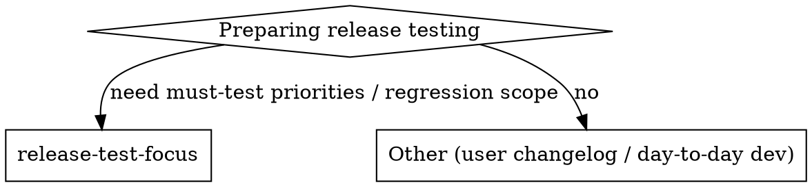
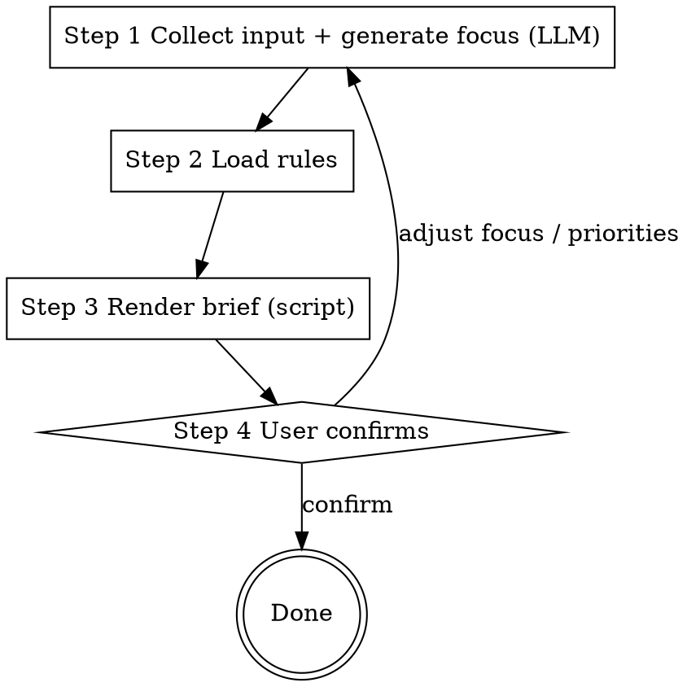

# Release Test Brief

## Overview

Compile the two kinds of changes in a release — **main-project code changes** (tickets behind PRs) and **dependency-library upgrades** (their tickets) — into one structured brief that lets testers see at a glance *what must be tested this release* and *where to regress*.

All tickets are homogeneous: `id / title / description / type (Story|Defect) / priority / source (main|dependency)`; dependency tickets additionally carry `library / version change`.

**Division of labor:** semantic work (reading descriptions, generating the test focus) is done by the LLM; mechanical work (priority mapping, must-test selection, sort, risk, rendering) is done by the script reading `rules.ini`. Rules live only in `rules.ini` — never edit SKILL.md or the script to change behavior.

## When to use



Use before a release, when producing a "what to focus testing on" brief for the QA team.
Not for end-user release notes (changelogs) or day-to-day development.

## Workflow



**Violating the letter of this workflow is violating its spirit.**

### Step 1 — Collect input (incl. generating the test focus)
Ask the user for: release meta (version, baseline, window) + the ticket list. Ticket fields: `id / title / description / type (Story|Defect) / priority (your team's real naming) / source (main|dependency)`; dependency tickets also need `library / version_from / version_to`.

Do the semantic work in the same pass: for each ticket, read `description`, distill **one testable focus line** using the table below, and store it in the ticket's `focus` field. Assemble the result into `tickets.json` (schema below). This is LLM work — the script cannot do it.

| Type | Source | Focus distillation |
|---|---|---|
| Story | main | new behavior/scenario → happy-path + error + boundary |
| Defect | main | the fix → fixed scenario + boundary conditions |
| Story | dependency | behavior change from the upgrade → regression of features that use the library |
| Defect | dependency | the library's fix → whether we are affected + regression scope |

> Never paste `description` verbatim as `focus`; distill it into "what to test".

### Step 2 — Load rules
Read `rules.ini`. It is the **single source of truth** for priority mapping, must-test conditions, sort order, risk levels, and navigation. Map priorities via `priority_mapping` — never from memory. If a priority is not in the mapping, the script errors and tells you to add it to `rules.ini`.

### Step 3 — Render brief (mechanical, script)
Run:

```
python scripts/render_brief.py tickets.json [-o release-test-focus.md]
```

The script performs priority mapping, must-test selection, sorting, overall risk, breaking-change keyword scan, and Markdown output (with a table of contents and clickable anchors). Ticket IDs in the must-test table link to their detail entries below.

### Step 4 — User confirms
Show the "§1 Must-test priorities" table first for the user to calibrate (add/remove items, adjust focus or order). Only after confirmation produce the full brief. Do not skip this and dump the whole document.

## Input: tickets.json

```json
{
  "meta": { "version": "v2.4.0", "baseline": "v2.3.2", "window": "2026-07-01" },
  "tickets": [
    { "id": "ENG-1024", "title": "New payment flow", "description": "...",
      "type": "Story", "priority": "blocker", "source": "main",
      "focus": "Happy-path checkout / error fallback / concurrent orders" },
    { "id": "LIB-221", "title": "Upgrade auth-sdk", "description": "...breaking...",
      "type": "Defect", "priority": "critical", "source": "dependency",
      "library": "auth-sdk", "version_from": "1.8", "version_to": "2.0",
      "focus": "Regression: login / SSO / refresh / logout full chain" }
  ]
}
```

`priority` takes your team's real naming (e.g. blocker / critical / major…); `rules.ini` maps it. `focus` is produced in Step 1. See `examples/sample-tickets.json`.

## Output structure

A single Markdown document, top to bottom:

- **Contents** (clickable links to each section)
- **§0 Overview** — version / window / scope / overall risk
- **§1 Must-test priorities** — a table sorted per `rules.ini`; Ticket IDs link to §2/§3 details
- **§2 Main-project changes** — grouped into Stories / Defects, by descending priority; each entry shows its test focus
- **§3 Dependency upgrades** — library / version change / ticket / type / priority / regression hint

All criteria come from `rules.ini` (three must-test conditions: weight ≥ threshold / dependency upgrade / breaking change; any one qualifies). Low-priority tickets are excluded from §1 but still appear **in full** in §2/§3.

## Common mistakes

| Mistake | Fix |
|---|---|
| Judging must-test / priority from memory instead of reading `rules.ini` | Always read `rules.ini` in Step 2; mapping is authoritative |
| Pasting the ticket description as the focus | Distill it into "what to test" per the focus table |
| Mixing dependency upgrades with main changes, no regression framing | Keep dependencies in their own section (§3), framed as regression |
| Dropping low-priority tickets | The full lists (§2/§3) must be exhaustive, not just must-test items |
| Skipping Step 4 and emitting the whole document | Calibrate the priorities table first, then render the full brief |
| Editing SKILL.md or the script to change rules | Only edit `rules.ini`; SKILL.md and the script are fixed |
