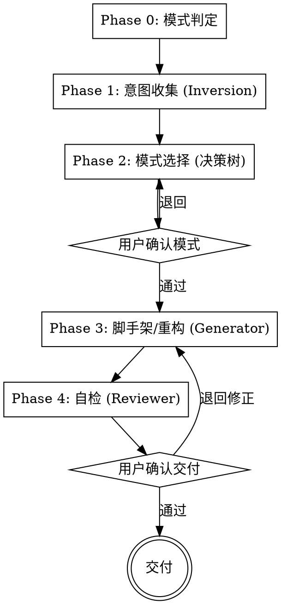

# skill-architect

## 概述

**架构先于内容。** 一个 skill 的结构模式决定了它是否可控、可维护、可按需加载。本 skill 用 Google ADK 的 5 种设计模式（Tool Wrapper / Generator / Reviewer / Inversion / Pipeline）帮你：选模式、出脚手架、把屎山重构成模块化架构。

**本 skill 自己就是一个 Pipeline**——它示范自己教的模式：Phase 1 用 Inversion 收集意图，Phase 2 用决策树（Tool Wrapper 知识）选模式，Phase 3 用 Generator 出脚手架，Phase 4 用 Reviewer 自检。

违反字面规则，就是违反这个 skill 的精神。

## 何时使用

- 要**新建**一个 skill，但不确定该用什么结构 / 模式
- 想要某种模式的**脚手架模板**
- 有个**现成的、乱糟糟的** skill（规则全硬编码、一个文件干五件事），想重构成清爽的模块化架构
- 想知道某个 skill **该用哪种模式**

**不要用于：**

- 通用代码重构 → 直接做
- 改 skill 的**内容措辞质量** → 用 `writing-skills`

## 铁律

```
没有选定模式，就不准动手写 / 重构。
```

每次必须先走完 Phase 1（意图收集）+ Phase 2（模式选择）并经用户确认，才进 Phase 3。跳过选模式直接堆内容，违反本 skill 精神。

**无例外：**
- 不是"模式很显然就不用选"
- 不是"我已经知道用哪个"
- 不是"先写出来再套模式"
- 重构时同样必须先诊断、先选模式，再动刀

## 依赖

- **Requires:** `writing-skills`（产物遵循其 frontmatter / "Use when..." / 结构规范）

## 边界（与同类 skill）

| Skill | 解决什么 | 产物 |
|---|---|---|
| `writing-skills` | 内容**质量** | 同一个 skill，写得更好 |
| `splitting-skills` | 太**大**→拆 | **多个** skill |
| `skill-architect` | **结构模式** + 渐进披露 + 屎山→模块化 | **一个** skill，架构清爽 |

本 skill 始终产出**单个** skill，只改其内部架构；产**多个**是 splitting-skills 的事。

## 模式速查（决策树，每次都要用）

```
要让 agent 成为某库/领域专家?        → Tool Wrapper
产物每次必须遵循固定模板?             → Generator
要对照 checklist 评估、按严重度归类?  → Reviewer
动手前必须先问清用户?                 → Inversion
有顺序依赖、步骤间要校验门?           → Pipeline
命中多个? → 组合（见下）
```

| 信号 | 模式 | 用到的目录 | 复杂度 |
|---|---|---|---|
| 成为某库/框架/领域专家 | Tool Wrapper | `references/` | 低 |
| 产物遵循固定模板 | Generator | `assets/`+`references/` | 中 |
| 对照 checklist 评估 | Reviewer | `references/` | 中 |
| 动手前先问清用户 | Inversion | `assets/` | 中（多轮） |
| 有顺序依赖、步骤间校验门 | Pipeline | 三者全用 | 高 |

**组合规则：** Pipeline 可内嵌 Reviewer；Generator 可用 Inversion 收集输入；Tool Wrapper 可作为 Pipeline 内的 reference。生产系统通常组合 2-3 种。

> 五模式详解（何时用、目录、门控写法）按需加载 `references/pattern-catalog.md`。

## 五阶段流程（Phase 0–4，带门控）



每个 phase 必须完成才能进下一个；门要求**显式**用户确认。

### Phase 0：模式判定
判定本次是**新建**还是**重构**。重构则先读目标 `SKILL.md` 及同目录全部资源（已有 `assets/`、`references/`、`scripts/`）。

### Phase 1：意图收集（Inversion）
一次只问一个问题，多选优先：
- **新建**：产物是什么？需要用户交互吗？多步吗？需要评估打分吗？产物要固定格式吗？
- **重构**：读完后推断——现在哪里乱、违反了哪种模式、本该是哪种。
**不拿齐关键信息不准进 Phase 2。**

### Phase 2：模式选择（决策树）
- **新建**：用决策树推荐最佳模式（可多选 + 注明组合）。
- **重构**：诊断当前违反了哪种模式、应改成哪种。
输出：推荐模式 + 理由 + 是否组合。
**门：** 用户确认模式选择。

### Phase 3：脚手架 / 重构（Generator）
- **新建**：按 `assets/templates/<模式>.md` 填充，产出 `SKILL.md` + 需要的 `assets/`/`references/` 骨架（遵循 writing-skills 规范）。
- **重构**：硬编码规则→`references/`、输出格式→`assets/`、`SKILL.md` 减薄成编排器；**保持行为等价，不删原功能**。
**门：** 用户审阅产出。

### Phase 4：自检（Reviewer）
加载 `references/refactor-checklist.md` 逐条查：description 触发对不对、渐进披露到不到位、模式用对没、有无屎山味。产出 findings→修→交付。
**门：** 用户确认交付。

## 速查

| Phase | 做什么 | 门 |
|---|---|---|
| 0 模式判定 | 新建 or 重构；重构先读目标 | — |
| 1 意图收集 | 一次一问，收齐意图 | — |
| 2 模式选择 | 决策树推荐 / 诊断 | 用户确认模式 |
| 3 脚手架/重构 | 按模板填充 / 抽离外置 | 用户审阅产出 |
| 4 自检 | 用 refactor-checklist 查 | 用户确认交付 |

## 常见错误

| 错误 | 修正 |
|---|---|
| 没选模式就开始堆内容 | 回 Phase 1/2，选定并经用户确认 |
| 重构时删了原有功能 | 只改架构，保持行为等价 |
| 把所有规则又硬编码回 SKILL.md | 抽到 references/、assets/，渐进披露 |
| description 写成工作流摘要 | 只写"Use when..."触发条件（CSO 铁律） |
| 该用 Pipeline 却没加门控 | 顺序步骤间加 `Do NOT proceed until…` 门 |
| 该用单模式却硬套 Pipeline | 单步能搞定别套流水线，证明有收益才加复杂度 |

## 危险信号 —— 停下重来

- 你在没选模式的情况下开始写 / 重构
- 产出又是一个把规则全硬编码的单文件
- 重构产物丢了原 skill 的功能
- description 摘要了工作流而不是写触发条件
- 你觉得"差不多了" → 跑一遍 Phase 4 自检再说
