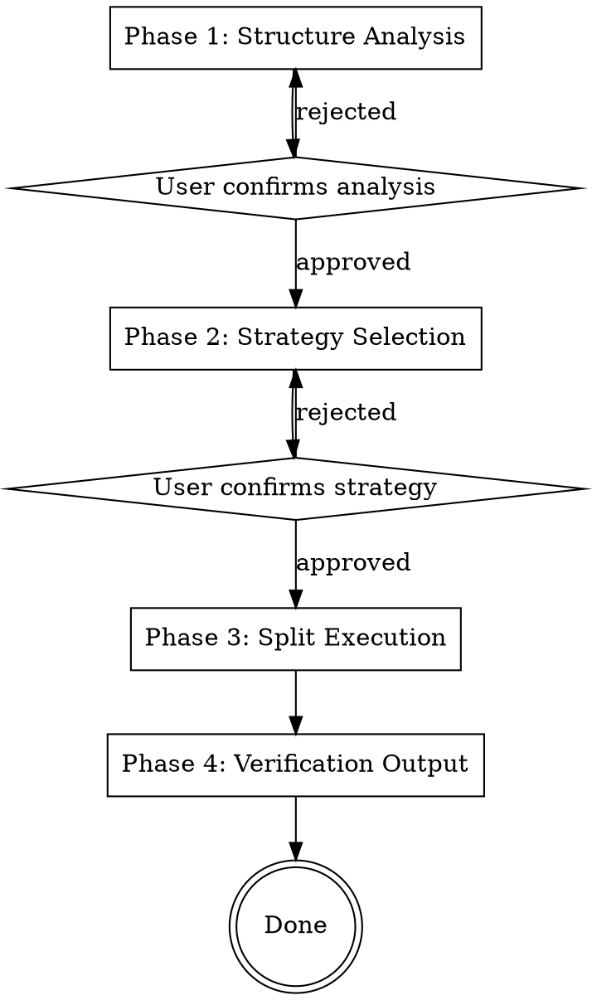
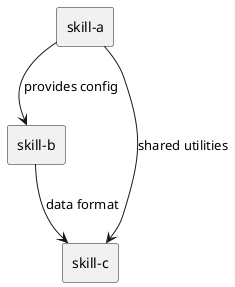

# Splitting Skills

## Overview

**Splitting is not cutting — it's reorganizing.** Each sub-skill must be independently usable, have a single responsibility, and declare its dependencies explicitly.

This skill guides you through a four-phase gated workflow to decompose large, complex skills or structured knowledge into multiple smaller, standards-compliant Agent Skills.

**Violating the letter of this process is violating the spirit of skill splitting.**

## When to Use

> **Important:** This skill should ONLY be invoked when the user explicitly asks to split/decompose a skill (切分skill). General refactoring and code organization tasks do NOT trigger this skill.

- A single skill file has grown too large or complex to maintain efficiently
- Parts of a skill could be reused independently in other contexts
- Multi-agent coordination requires clear task boundaries
- A tree-like knowledge structure needs to be converted into actionable Agent Skills
- You find yourself saying "this skill does too many things"

**Do NOT use when:**

- The skill is already focused and manageable
- The knowledge structure is too small to benefit from splitting (< 3 identifiable nodes)
- You just want to reorganize sections within a single skill (use editing instead)

## The Iron Law

```
NO SPLIT WITHOUT ANALYSIS FIRST.
```

Every split must be preceded by Phase 1 (structure analysis). Skipping analysis and splitting blindly violates the spirit of this skill.

**No exceptions:**
- Not for "obviously structured" input
- Not for "I already know how to split this"
- Not for "just split it by headings"
- Not for time pressure
- Analysis means running Phase 1 completely, not skimming

## Dependencies

**Requires:** writing-skills
**Required by:** None

## The Four Phases



Each phase MUST complete before proceeding. You cannot skip phases. Gates require explicit user confirmation.

---

## Phase 1: Structure Analysis

### Purpose

Parse the input into a node tree with resource awareness, identifying nodes, their attributes, and dependencies.

### Input Types

| Input Type | Detection Signals | Processing |
|------------|-------------------|------------|
| **SKILL.md file** | YAML frontmatter, markdown heading hierarchy | Decompose by heading levels into node tree |
| **Arbitrary structured knowledge** | Indentation levels, numbered lists, XML/JSON trees, mind map text | Parse by structural markers into node tree |

### Input Scope — Resource Aware

Handle the complete resource tree, not just the main file:

1. **Identify input scope:**
   - Main file (SKILL.md or other primary document)
   - Referenced files (markdown reference docs, scripts, templates)
   - External dependencies (other skills, tool chain requirements)

2. **Build complete resource tree:**

   ```
   main-skill/
   ├── SKILL.md            ← Main document
   ├── reference.md        ← Referenced documentation
   ├── scripts/
   │   └── tool.sh         ← Referenced script
   └── examples/
       └── demo.md         ← Example file
   ```

### Parsing Process

1. **Read complete input content** including all referenced resources
2. **Identify structural markers:** markdown headings, indentation levels, numbering (1. 1.1 1.1.1), XML/JSON hierarchy
3. **Build node tree:** each identifiable semantic unit (section, module, functional block) as a node
4. **Annotate each node:**
   - **Node type:** concept / process / rule / reference / tool / script
   - **Size:** line count or token estimate
   - **Dependencies:** inter-node references, prerequisites
   - **Independence score:** 0-1 (see calculation below)
   - **Associated resources:** external files referenced by or referencing this node

### Independence Score

Computed as average of three components:

- **Reference autonomy** (0-1): How few references this node makes to other nodes (0 = heavy references outward, 1 = self-contained)
- **Incoming coupling** (0-1): How few other nodes reference this node (0 = referenced by many, 1 = isolated)
- **Semantic completeness** (0-1): Whether this node contains a complete concept/process (0 = fragment, 1 = complete unit)

Thresholds:
- **>0.7:** Highly independent — strong candidate for Element strategy
- **0.4-0.7:** Moderately coupled — needs dependency-aware strategy (Process or Hierarchy)
- **<0.4:** Heavily coupled — splitting may require significant dependency management

### Early Exit Criteria

If analysis shows any of these conditions, recommend NOT splitting and explain why:

| Condition | Signal | Recommendation |
|-----------|--------|----------------|
| Too small | Total nodes < 3 or total content < 50 lines | "Input is too small to benefit from splitting" |
| Already optimal | All nodes have independence score > 0.8 and structure is flat | "Input is already well-structured as a single skill" |
| No structure detected | Cannot identify hierarchy, process, or independent elements | "Input lacks discernible structure for splitting" |
| Unresolvable circular deps | All nodes form a single dependency cycle with no entry point | "Input has circular dependencies that prevent clean splitting" |

If an early exit is triggered, present the finding and stop. User may override with explicit instruction to proceed anyway.

### Circular Dependency Handling

If circular dependencies are detected:

1. Identify the minimal cycle set
2. Attempt to break cycles by finding shared abstractions that can be extracted into a separate skill
3. If cycles cannot be broken, present options to the user:
   - Extract shared portion into a new utility skill
   - Merge the cyclic nodes into a single skill
   - Proceed with documented circular dependencies (not recommended)

### Output to User

- Node tree visualization (markdown tree or simple graphviz)
- Attribute summary for each node (type, size, independence score)
- Detected dependency list
- Structure health assessment (suitability for splitting, circular dependencies, early exit warnings)

**Gate:** User confirms analysis is accurate before proceeding to Phase 2.

---

## Phase 2: Strategy Selection

### Purpose

Select the splitting strategy and granularity level based on Phase 1 analysis.

### Built-in Strategies

| Strategy | Best For | Splits By |
|----------|----------|-----------|
| **Hierarchy** | Input has clear hierarchical structure (h1 > h2 > h3) | Hierarchy boundaries; each layer or subtree becomes one skill |
| **Process** | Input describes workflows, stages, steps | Process stages; each stage becomes one skill |
| **Element** | Input contains multiple independent concerns/functions | Responsibility boundaries; each domain becomes one skill |
| **Nine-Grid** | Input is a complex system needing multi-dimensional decomposition | Two orthogonal dimensions (e.g., complexity × stage) into a matrix |

**REQUIRED:** See `strategies.md` in this skill's directory for detailed descriptions, examples, and granularity controls for each strategy.

### Auto-Recommendation Logic

Based on Phase 1 analysis:

- Node tree depth > 3 with uniform hierarchy → recommend **Hierarchy**
- Nodes have clear sequential/causal dependencies → recommend **Process**
- Node independence scores generally high (>0.7) → recommend **Element**
- Nodes have cross-dependencies across multiple dimensions → recommend **Nine-Grid**

When multiple signals conflict, prioritize: Process > Element > Hierarchy > Nine-Grid (process dependencies are the strongest signal).

### Granularity Options

Present to user as descriptive choices:

- **Fine:** "One skill per independent functional block" — maximizes reusability, more skills to manage
- **Medium:** "Split by major modules" — balanced granularity
- **Coarse:** "Split by major phases" — fewer skills, larger scope each

### User Interaction

1. Display auto-recommended strategy with reasoning
2. Show all built-in strategies with brief descriptions for user to switch
3. Show estimated split result (expected number of skills, rough content scope)
4. User selects or adjusts strategy and granularity

**Gate:** User confirms strategy and granularity before proceeding to Phase 3.

---

## Phase 3: Split Execution

### Purpose

Execute the split and generate standards-compliant SKILL.md files with associated resources.

### Execution Process

1. **Group nodes by selected strategy** to form sub-skill boundaries
2. **Allocate resources** with conflict resolution (see below)
3. **Generate standard SKILL.md for each sub-skill**, following `templates/skill-output-template.md`:
   - YAML frontmatter (name + description, description starts with "Use when...")
   - Overview, When to Use, Dependencies, Core Pattern, Quick Reference, Implementation, Common Mistakes
4. **Generate sub-skill directory structure**

### Resource Conflict Resolution

When two or more sub-skills need the same file:

| Conflict Type | Resolution |
|---------------|------------|
| **Read-only reference** (API docs, syntax guide) | Duplicate into each sub-skill that needs it |
| **Shared utility** (script, helper, template) | Extract into a new shared-utility sub-skill. Both consumers declare it in `Requires` |
| **Configuration/data** | Assign to primary owning skill. Others reference via dependency |

**Decision rule:** Resource needed by 1 sub-skill → assign directly. Needed by 2+ → evaluate using table above. Flag all conflicts in split report.

### Output Location

Output is created adjacent to the input source:
- File input at `path/to/original-skill/` → output at `path/to/original-skill-split/`
- Inline text input → output at `./split-output/`

```
original-skill-split/
├── splitting-report.md           # Split report
├── skill-a/
│   ├── SKILL.md
│   └── scripts/                  # Associated scripts
│       └── tool.sh
├── skill-b/
│   ├── SKILL.md
│   └── reference.md              # Associated reference docs
└── skill-c/
    └── SKILL.md
```

### Sub-Skill Naming

- Use lowercase with hyphens (e.g., `skill-authentication`, `skill-routing`)
- Name reflects the primary responsibility, not the source section title
- Each name must be unique within the split output

### Split Report

Generate `splitting-report.md` in the output root containing:

```markdown
# Skill Splitting Report

## Summary
- **Source:** [input file/structure]
- **Strategy:** [strategy used]
- **Granularity:** [fine/medium/coarse]
- **Result:** [N] skills generated

## Generated Skills
| Skill | Type | Description | Dependencies | Associated Files |
|-------|------|-------------|--------------|------------------|

## Dependency Graph
[PlantUML diagram showing inter-skill dependencies]

## Coverage Check
- Original nodes: [N]
- Covered by splits: [N]
- Orphaned: [list]
- Redundant overlaps: [list]
```

Use PlantUML for the dependency graph:



---

## Phase 4: Verification Output

### Purpose

Validate completeness, independence, and standards compliance of all generated skills.

### Verification Checklist

| Check | Description | Pass Condition |
|-------|-------------|----------------|
| **Coverage** | Every node from original input is assigned to a sub-skill | No orphaned nodes |
| **Independence** | Each sub-skill can be understood and used independently | No unresolved internal references |
| **Standards Compliance** | Each SKILL.md follows writing-skills conventions | Frontmatter correct, structure complete |
| **Dependency Completeness** | All cross-skill references have corresponding declarations | Requires/Required by forms a closed loop |
| **No Redundancy** | No unnecessary content duplication | Duplicated lines between generated SKILL.md files < 5% |
| **Resource Attribution** | Referenced files/scripts correctly allocated | No dangling references |
| **Testability Reminder** | Each generated skill is a candidate for TDD validation | Remind user to test per writing-skills Iron Law |

### Testing Guidance

Generated skills are NOT automatically tested — testing is the user's responsibility. Phase 4 MUST:

1. **Remind the user** that each generated skill should be tested following the `writing-skills` TDD process (RED-GREEN-REFACTOR with pressure scenarios)
2. **Suggest priority order:** start with leaf skills (no `Requires`) since they have no downstream dependencies
3. **Flag skills** most likely to need testing attention — skills with high dependency counts or complex resource allocations

### Output

1. Display verification results (pass/fail per check + specific issues)
2. If issues found, provide fix suggestions
3. Final deliverables:
   - Complete directory for each sub-skill (SKILL.md + associated resources)
   - Split report with PlantUML dependency graph

---

## Quick Reference

| Phase | Input | Output | Gate |
|-------|-------|--------|------|
| 1. Structure Analysis | SKILL.md or structured knowledge | Node tree + resource tree + health assessment | User confirms analysis |
| 2. Strategy Selection | Phase 1 results | Strategy + granularity choice | User confirms strategy |
| 3. Split Execution | Strategy + node tree | Sub-skill SKILL.md files + split report | (automatic) |
| 4. Verification Output | Generated skills + report | Verified deliverables | (final) |

## Common Mistakes

| Mistake | Fix |
|---------|-----|
| Splitting without Phase 1 analysis | Run Phase 1 completely. No shortcuts. |
| Ignoring resource dependencies | Check all file references, script includes, and cross-links before splitting |
| Creating skills that are too small | A skill should be independently useful. If it only makes sense alongside another, merge them. |
| Creating skills that are still too large | If a generated skill still has > 5 distinct concerns, consider splitting it further. |
| Forgetting dependency declarations | Every cross-skill reference must appear in both `Requires` and `Required by`. |
| Duplicating shared code | Use shared-utility sub-skill instead of copying scripts across skills. |
| Skipping verification | Phase 4 catches coverage gaps, broken dependencies, and standards violations. |

## Red Flags — STOP and Re-analyze

- You're splitting without having completed Phase 1
- A generated skill has no clear "Use when..." trigger
- Two generated skills have identical "When to Use" sections
- A dependency graph shows a cycle with no plan to resolve it
- A generated skill is just a copy of a section header with no content
- You think "this is good enough" — verify it
