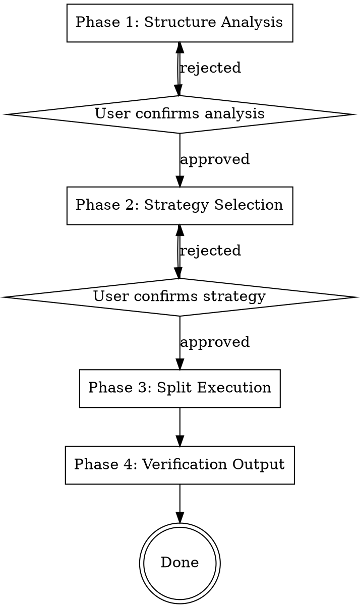

# Splitting Skills

## Overview

**Splitting is not cutting — it's reorganizing.** Each sub-skill must be independently usable, have a single responsibility, and declare its dependencies explicitly.

This skill guides you through a four-phase gated workflow to decompose large, complex skills or structured knowledge into multiple smaller, standards-compliant Agent Skills.

**Violating the letter of this process is violating the spirit of skill splitting.**

## When to Use

- A single skill file has grown too large or complex to maintain efficiently
- Parts of a skill could be reused independently in other contexts
- Multi-agent coordination requires clear task boundaries
- A tree-like knowledge structure needs to be converted into actionable Agent Skills
- You find yourself saying "this skill does too many things"

**Do NOT use when:**

- The skill is already focused and manageable
- The knowledge structure is too small to benefit from splitting (< 3 identifiable nodes)
- You just want to reorganize sections within a single skill (use editing instead)

## The Iron Law

```
NO SPLIT WITHOUT ANALYSIS FIRST.
```

Every split must be preceded by Phase 1 (structure analysis). Skipping analysis and splitting blindly violates the spirit of this skill.

**No exceptions:**
- Not for "obviously structured" input
- Not for "I already know how to split this"
- Not for "just split it by headings"
- Not for time pressure
- Analysis means running Phase 1 completely, not skimming

## Dependencies

**Requires:** writing-skills

## The Four Phases


```dot
digraph splitting_phases {
    "Phase 1: Structure Analysis" [shape=box];
    "Phase 2: Strategy Selection" [shape=box];
    "Phase 3: Split Execution" [shape=box];
    "Phase 4: Verification Output" [shape=box];
    "User confirms analysis" [shape=diamond];
    "User confirms strategy" [shape=diamond];
    "Done" [shape=doublecircle];

    "Phase 1: Structure Analysis" -> "User confirms analysis";
    "User confirms analysis" -> "Phase 2: Strategy Selection" [label="approved"];
    "User confirms analysis" -> "Phase 1: Structure Analysis" [label="rejected"];
    "Phase 2: Strategy Selection" -> "User confirms strategy";
    "User confirms strategy" -> "Phase 3: Split Execution" [label="approved"];
    "User confirms strategy" -> "Phase 2: Strategy Selection" [label="rejected"];
    "Phase 3: Split Execution" -> "Phase 4: Verification Output";
    "Phase 4: Verification Output" -> "Done";
}
```

Each phase MUST complete before proceeding. Gates require explicit user confirmation.

---

## Phase 1: Structure Analysis

### Purpose

Parse the input into a node tree with resource awareness, identifying nodes, their attributes, and dependencies.

### Core Steps

1. **Read complete input content** including all referenced resources
2. **Build a resource-aware node tree:** each semantic unit (section, module, functional block) becomes a node, annotated with type, size, dependencies, independence score, and associated resources
3. **Assess structure health:** detect early-exit conditions (too small / already optimal / no structure / circular deps) and recommend NOT splitting if triggered
4. **Handle circular dependencies** when detected (break via shared abstraction, else present options)

> **Detailed reference (load when executing Phase 1):** `references/analysis-details.md` — Input Types, Input Scope (resource tree), Parsing Process, Independence Score formula + thresholds, Early Exit Criteria, Circular Dependency Handling.

### Output to User

- Node tree visualization (markdown tree or simple graphviz)
- Attribute summary for each node (type, size, independence score)
- Detected dependency list
- Structure health assessment (suitability for splitting, circular dependencies, early exit warnings)

**Gate:** User confirms analysis is accurate before proceeding to Phase 2.

---

## Phase 2: Strategy Selection

### Purpose

Select the splitting strategy and granularity level based on Phase 1 analysis.

### Built-in Strategies

| Strategy | Best For | Splits By |
|----------|----------|-----------|
| **Hierarchy** | Input has clear hierarchical structure (h1 > h2 > h3) | Hierarchy boundaries; each layer or subtree becomes one skill |
| **Process** | Input describes workflows, stages, steps | Process stages; each stage becomes one skill |
| **Element** | Input contains multiple independent concerns/functions | Responsibility boundaries; each domain becomes one skill |
| **Nine-Grid** | Input is a complex system needing multi-dimensional decomposition | Two orthogonal dimensions (e.g., complexity × stage) into a matrix |

> **Detailed reference (load when comparing strategies):** `references/strategies.md` — full descriptions, worked examples, and granularity controls for each strategy.

### Auto-Recommendation Logic

Based on Phase 1 analysis:

- Node tree depth > 3 with uniform hierarchy → recommend **Hierarchy**
- Nodes have clear sequential/causal dependencies → recommend **Process**
- Node independence scores generally high (>0.7) → recommend **Element**
- Nodes have cross-dependencies across multiple dimensions → recommend **Nine-Grid**

When multiple signals conflict, prioritize: Process > Element > Hierarchy > Nine-Grid (process dependencies are the strongest signal).

### Granularity Options

Present to user as descriptive choices:

- **Fine:** "One skill per independent functional block" — maximizes reusability, more skills to manage
- **Medium:** "Split by major modules" — balanced granularity
- **Coarse:** "Split by major phases" — fewer skills, larger scope each

### User Interaction

1. Display auto-recommended strategy with reasoning
2. Show all built-in strategies with brief descriptions for user to switch
3. Show estimated split result (expected number of skills, rough content scope)
4. User selects or adjusts strategy and granularity

**Gate:** User confirms strategy and granularity before proceeding to Phase 3.

---

## Phase 3: Split Execution

### Purpose

Execute the split and generate standards-compliant SKILL.md files with associated resources.

### Execution Process

1. **Group nodes by selected strategy** to form sub-skill boundaries
2. **Allocate resources** with conflict resolution (see below)
3. **Generate standard SKILL.md for each sub-skill**, following `assets/templates/skill-output-template.md`
4. **Generate sub-skill directory structure**

### Resource Conflict Resolution

When two or more sub-skills need the same file:

| Conflict Type | Resolution |
|---------------|------------|
| **Read-only reference** (API docs, syntax guide) | Duplicate into each sub-skill that needs it |
| **Shared utility** (script, helper, template) | Extract into a new shared-utility sub-skill. Both consumers declare it in `Requires` |
| **Configuration/data** | Assign to primary owning skill. Others reference via dependency |

**Decision rule:** Resource needed by 1 sub-skill → assign directly. Needed by 2+ → evaluate using table above. Flag all conflicts in split report.

### Output Location

Output is created adjacent to the input source:
- File input at `path/to/original-skill/` → output at `path/to/original-skill-split/`
- Inline text input → output at `./split-output/`

```
original-skill-split/
├── splitting-report.md           # Split report
├── skill-a/
│   ├── SKILL.md
│   └── scripts/                  # Associated scripts
│       └── tool.sh
├── skill-b/
│   ├── SKILL.md
│   └── reference.md              # Associated reference docs
└── skill-c/
    └── SKILL.md
```

### Sub-Skill Naming

- Use lowercase with hyphens (e.g., `skill-authentication`, `skill-routing`)
- Name reflects the primary responsibility, not the source section title
- Each name must be unique within the split output

### Split Report

Generate `splitting-report.md` in the output root with summary, generated-skills table, dependency graph (PlantUML), and coverage check.

> **Generator template (load when producing the report):** `assets/templates/split-report-template.md` — report markdown body + PlantUML dependency-graph example.

---

## Phase 4: Verification Output

### Purpose

Validate completeness, independence, and standards compliance of all generated skills.

### Core Steps

1. **Run the verification checklist** against every generated skill
2. **Apply testing guidance** — remind the user testing is their responsibility; suggest starting with leaf skills; flag high-dependency skills
3. **Report** pass/fail per check with specific issues and fix suggestions

> **Detailed reference (load when executing Phase 4):** `references/verification-checklist.md` — full 7-check verification table + testing guidance.

### Output

1. Display verification results (pass/fail per check + specific issues)
2. If issues found, provide fix suggestions
3. Final deliverables:
   - Complete directory for each sub-skill (SKILL.md + associated resources)
   - Split report with PlantUML dependency graph

---

## Quick Reference

| Phase | Input | Output | Gate |
|-------|-------|--------|------|
| 1. Structure Analysis | SKILL.md or structured knowledge | Node tree + resource tree + health assessment | User confirms analysis |
| 2. Strategy Selection | Phase 1 results | Strategy + granularity choice | User confirms strategy |
| 3. Split Execution | Strategy + node tree | Sub-skill SKILL.md files + split report | (automatic) |
| 4. Verification Output | Generated skills + report | Verified deliverables | (final) |

## Common Mistakes

| Mistake | Fix |
|---------|-----|
| Splitting without Phase 1 analysis | Run Phase 1 completely. No shortcuts. |
| Ignoring resource dependencies | Check all file references, script includes, and cross-links before splitting |
| Creating skills that are too small | A skill should be independently useful. If it only makes sense alongside another, merge them. |
| Creating skills that are still too large | If a generated skill still has > 5 distinct concerns, consider splitting it further. |
| Forgetting dependency declarations | Every cross-skill reference must appear in both `Requires` and `Required by`. |
| Duplicating shared code | Use shared-utility sub-skill instead of copying scripts across skills. |
| Skipping verification | Phase 4 catches coverage gaps, broken dependencies, and standards violations. |

## Red Flags — STOP and Re-analyze

- You're splitting without having completed Phase 1
- A generated skill has no clear "Use when..." trigger
- Two generated skills have identical "When to Use" sections
- A dependency graph shows a cycle with no plan to resolve it
- A generated skill is just a copy of a section header with no content
- You think "this is good enough" — verify it
