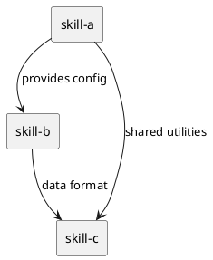

# Skill Splitting Report Template

Generator template for the `splitting-report.md` produced in Phase 3. Fill placeholders.

## Report Body

```markdown
# Skill Splitting Report

## Summary
- **Source:** [input file/structure]
- **Strategy:** [strategy used]
- **Granularity:** [fine/medium/coarse]
- **Result:** [N] skills generated

## Generated Skills
| Skill | Type | Description | Dependencies | Associated Files |
|-------|------|-------------|--------------|------------------|

## Dependency Graph
[PlantUML diagram showing inter-skill dependencies]

## Coverage Check
- Original nodes: [N]
- Covered by splits: [N]
- Orphaned: [list]
- Redundant overlaps: [list]
```

## Dependency Graph (PlantUML)


